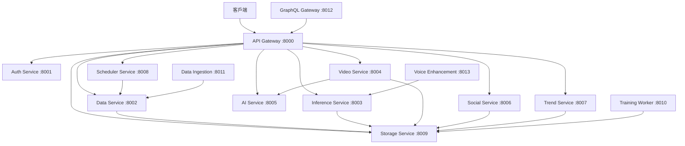

# 微服務文檔索引

## 📚 服務列表

本項目包含以下微服務，每個服務都有完整的文檔和 API 說明：

| 服務名稱 | 描述 | 端口 | 文檔 | API |
|---------|------|------|------|-----|
| API Gateway | 統一 API 入口點，處理路由、認證和負載均衡 | 8000 | [README](./src/services/api-gateway/README.md) | [API 文檔](./src/services/api-gateway/API.md) |
| Authentication Service | 用戶認證、授權和會話管理服務 | 8001 | [README](./src/services/auth-service/README.md) | [API 文檔](./src/services/auth-service/API.md) |
| Data Processing Service | 音頻數據處理、驗證和存儲服務 | 8002 | [README](./src/services/data-service/README.md) | [API 文檔](./src/services/data-service/API.md) |
| Model Inference Service | 機器學習模型推論和語音合成服務 | 8003 | [README](./src/services/inference-service/README.md) | [API 文檔](./src/services/inference-service/API.md) |
| Video Generation Service | 視頻生成、編輯和處理服務 | 8004 | [README](./src/services/video-service/README.md) | [API 文檔](./src/services/video-service/API.md) |
| AI Orchestration Service | AI 服務編排，整合多個 AI 模型和 API | 8005 | [README](./src/services/ai-service/README.md) | [API 文檔](./src/services/ai-service/API.md) |
| Social Media Service | 社交媒體平台整合和內容發布服務 | 8006 | [README](./src/services/social-service/README.md) | [API 文檔](./src/services/social-service/API.md) |
| Trend Analysis Service | 趨勢分析、關鍵字挖掘和競爭對手分析服務 | 8007 | [README](./src/services/trend-service/README.md) | [API 文檔](./src/services/trend-service/API.md) |
| Task Scheduler Service | 任務調度、工作流程管理和自動化服務 | 8008 | [README](./src/services/scheduler-service/README.md) | [API 文檔](./src/services/scheduler-service/API.md) |
| File Storage Service | 文件存儲、管理和 CDN 服務 | 8009 | [README](./src/services/storage-service/README.md) | [API 文檔](./src/services/storage-service/API.md) |
| Model Training Worker | 機器學習模型訓練和優化後台服務 | 8010 | [README](./src/services/training-worker/README.md) | [API 文檔](./src/services/training-worker/API.md) |
| Data Ingestion Service | 數據收集、清理和預處理服務 | 8011 | [README](./src/services/data-ingestion/README.md) | [API 文檔](./src/services/data-ingestion/API.md) |
| GraphQL Gateway | GraphQL API 閘道器，統一數據查詢接口 | 8012 | [README](./src/services/graphql-gateway/README.md) | [API 文檔](./src/services/graphql-gateway/API.md) |
| Voice Enhancement Service | 語音增強、降噪和音質優化服務 | 8013 | [README](./src/services/voice-enhancement/README.md) | [API 文檔](./src/services/voice-enhancement/API.md) |

## 🏗️ 系統架構

## 🚀 快速導航

### 核心服務
- **[API Gateway](./src/services/api-gateway/README.md)** - 統一入口點
- **[Auth Service](./src/services/auth-service/README.md)** - 認證授權
- **[Data Service](./src/services/data-service/README.md)** - 數據處理

### AI & ML 服務  
- **[AI Service](./src/services/ai-service/README.md)** - AI 編排
- **[Inference Service](./src/services/inference-service/README.md)** - 模型推論
- **[Training Worker](./src/services/training-worker/README.md)** - 模型訓練
- **[Voice Enhancement](./src/services/voice-enhancement/README.md)** - 語音增強

### 內容處理服務
- **[Video Service](./src/services/video-service/README.md)** - 視頻生成
- **[Storage Service](./src/services/storage-service/README.md)** - 文件存儲
- **[Social Service](./src/services/social-service/README.md)** - 社交媒體

### 數據分析服務
- **[Trend Service](./src/services/trend-service/README.md)** - 趨勢分析
- **[Data Ingestion](./src/services/data-ingestion/README.md)** - 數據收集

### 基礎設施服務
- **[Scheduler Service](./src/services/scheduler-service/README.md)** - 任務調度
- **[GraphQL Gateway](./src/services/graphql-gateway/README.md)** - GraphQL API

## 📖 開發指南

1. **[架構設計](./docs/architecture.md)** - 系統架構說明
2. **[開發規範](./docs/development.md)** - 代碼規範和最佳實踐  
3. **[部署指南](./docs/deployment.md)** - 部署和運維
4. **[API 規範](./docs/api-guidelines.md)** - API 設計規範

## 🔧 開發工具

- **Docker Compose**: `docker-compose up -d`
- **健康檢查**: `./scripts/health-check.sh`
- **文檔生成**: `python scripts/generate-service-docs.py`
- **測試運行**: `./scripts/run-tests.sh`

---

**生成時間**: 2025-08-04  
**項目版本**: 1.0.0
