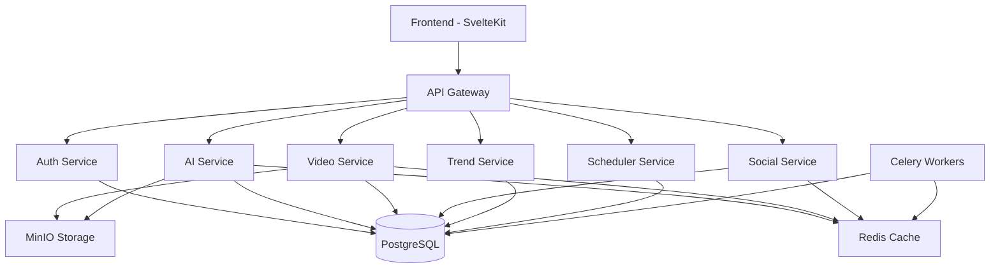

# Auto Video Generation System Documentation

## 📖 Overview

The Auto Video Generation System is a cutting-edge AI-powered platform that automatically creates viral short-form videos for social media platforms like TikTok, YouTube Shorts, and Instagram Reels.

## 🏗️ System Architecture

### Core Components



### Service Responsibilities

| Service | Purpose | Key Features |
|---------|---------|--------------|
| **API Gateway** | Request routing, authentication, rate limiting | Load balancing, SSL termination, CORS |
| **Auth Service** | User management, JWT tokens, permissions | OAuth integration, role-based access |
| **AI Service** | Text, image, and audio generation | GPT-4, DALL-E, Stable Diffusion, ElevenLabs |
| **Video Service** | Video composition and rendering | FFmpeg integration, template system |
| **Social Service** | Platform integration and publishing | TikTok, YouTube, Instagram APIs |
| **Trend Service** | Social media trend analysis | Real-time data collection, ML analysis |
| **Scheduler Service** | Task scheduling and automation | Cron jobs, queue management |

## 🚀 Quick Start

### Prerequisites

- Docker & Docker Compose
- Python 3.11+
- Node.js 18+
- PostgreSQL 15+
- Redis 7+

### Environment Setup

1. **Clone the repository**
   ```bash
   git clone https://github.com/your-org/auto-video-generation.git
   cd auto-video-generation
   ```

2. **Configure environment variables**
   ```bash
   cp .env.example .env
   # Edit .env with your API keys and database credentials
   ```

3. **Start the development environment**
   ```bash
   docker-compose up -d
   ```

4. **Initialize the database**
   ```bash
   chmod +x scripts/setup-database.sh
   ./scripts/setup-database.sh setup
   ```

5. **Access the application**
   - Frontend: http://localhost:5173
   - API Documentation: http://localhost:8000/docs
   - API Gateway: http://localhost:8000

### Default Credentials

**Admin User:**
- Email: `admin@autovideo.com`
- Username: `admin`
- Password: `admin123456`

**Demo Creator:**
- Email: `creator@autovideo.com`
- Username: `demo_creator`
- Password: `creator123`

⚠️ **Change these passwords in production!**

## 📚 API Documentation

### Interactive Documentation

- **Swagger UI**: http://localhost:8000/docs
- **ReDoc**: http://localhost:8000/redoc
- **OpenAPI Spec**: [docs/api/openapi.yaml](api/openapi.yaml)

### Authentication

All API endpoints require JWT authentication:

```bash
# Login to get token
curl -X POST http://localhost:8000/api/v1/auth/login \
  -H "Content-Type: application/json" \
  -d '{"email": "creator@autovideo.com", "password": "creator123"}'

# Use token in requests
curl -X GET http://localhost:8000/api/v1/auth/me \
  -H "Authorization: Bearer YOUR_JWT_TOKEN"
```

### Key API Endpoints

| Endpoint | Method | Description |
|----------|--------|-------------|
| `/api/v1/auth/login` | POST | User authentication |
| `/api/v1/ai/text/generate-script` | POST | Generate video script |
| `/api/v1/ai/images/generate` | POST | Generate AI images |
| `/api/v1/ai/audio/synthesize` | POST | Text-to-speech synthesis |
| `/api/v1/projects` | GET/POST | Manage video projects |
| `/api/v1/trends/keywords` | GET | Get trending topics |
| `/api/v1/social/publish` | POST | Schedule social media posts |

## 🔧 Development Guide

### Local Development

1. **Frontend Development**
   ```bash
   cd frontend
   npm install
   npm run dev
   ```

2. **Backend Development**
   ```bash
   cd services/auth-service
   python -m venv venv
   source venv/bin/activate
   pip install -r requirements-dev.txt
   uvicorn app.main:app --reload --port 8001
   ```

3. **Database Migrations**
   ```bash
   cd services/auth-service
   alembic revision --autogenerate -m "Description"
   alembic upgrade head
   ```

### Testing

```bash
# Run all tests
pytest

# Run specific service tests
pytest services/auth-service/tests/

# Run with coverage
pytest --cov=app --cov-report=html
```

### Code Quality

```bash
# Format code
black services/
isort services/

# Lint code
flake8 services/
mypy services/

# Security scan
bandit -r services/
```

## 🔒 Security

### Security Features

- **JWT Authentication** with refresh tokens
- **Rate Limiting** (60 requests/minute default)
- **HTTPS/TLS** encryption in production
- **Security Headers** (HSTS, CSP, X-Frame-Options)
- **Input Validation** and sanitization
- **SQL Injection** protection via SQLAlchemy ORM
- **XSS Protection** via Content Security Policy
- **CORS** configuration
- **Secret Management** via environment variables

### Security Best Practices

1. **Environment Variables**
   - Never commit `.env` files
   - Use strong, unique passwords
   - Rotate API keys regularly

2. **Database Security**
   - Use connection pooling
   - Enable SSL connections
   - Regular security updates

3. **API Security**
   - Implement proper authentication
   - Use HTTPS in production
   - Monitor for suspicious activity

## 🔄 CI/CD Pipeline

### GitHub Actions Workflows

- **Continuous Integration**: Run tests, security scans, and code quality checks
- **Security Scanning**: Trivy, Bandit, CodeQL, and dependency audits
- **Automated Deployment**: Deploy to staging/production environments

### Pipeline Stages

1. **Code Quality**: Black, isort, flake8, mypy
2. **Security**: Vulnerability scanning, secret detection
3. **Testing**: Unit tests, integration tests, coverage reports
4. **Build**: Docker image creation and registry push
5. **Deploy**: Automated deployment to target environments

## 📊 Monitoring & Observability

### Logging

- **Structured Logging** with JSON format
- **Log Levels**: DEBUG, INFO, WARNING, ERROR, CRITICAL
- **Log Aggregation** via ELK stack or similar

### Metrics

- **Application Metrics**: Request rates, response times, error rates
- **Business Metrics**: Video generation success rate, user engagement
- **Infrastructure Metrics**: CPU, memory, disk usage

### Health Checks

- **Service Health**: Individual service status endpoints
- **Database Health**: Connection and query performance
- **External APIs**: AI service availability and latency

## 🚢 Deployment

### Production Deployment

1. **Docker Compose (Recommended for small-scale)**
   ```bash
   # Use production compose file
   docker-compose -f docker-compose.prod.yml up -d
   ```

2. **Kubernetes (Recommended for scale)**
   ```bash
   # Apply Kubernetes manifests
   kubectl apply -f k8s/
   ```

3. **Cloud Deployment**
   - **AWS**: ECS, EKS, or Lambda
   - **Google Cloud**: Cloud Run, GKE
   - **Azure**: Container Instances, AKS

### Environment Configuration

| Environment | URL | Purpose |
|-------------|-----|---------|
| Development | http://localhost:8000 | Local development |
| Staging | https://staging-api.autovideo.com | Pre-production testing |
| Production | https://api.autovideo.com | Live system |

## 📈 Performance Optimization

### Caching Strategy

- **Redis Caching**: API responses, user sessions, trending data
- **CDN Integration**: Static assets, generated images/videos
- **Database Indexing**: Optimized queries and foreign keys

### Scalability

- **Horizontal Scaling**: Multiple service instances
- **Load Balancing**: Nginx reverse proxy with health checks
- **Database Optimization**: Connection pooling, read replicas
- **Asynchronous Processing**: Celery task queues

## 🔌 API Integration Examples

### Python SDK

```python
from autovideo import AutoVideoClient

client = AutoVideoClient(api_key="your_api_key")

# Generate a video script
script = client.ai.generate_script(
    topic="5 AI Tools for Productivity",
    style="engaging",
    duration_seconds=60
)

# Create images for the video
images = client.ai.generate_images(
    prompt="Modern workspace with AI elements",
    style="modern",
    aspect_ratio="9:16"
)

# Synthesize voice
audio = client.ai.synthesize_voice(
    text=script.content,
    voice_style="professional"
)
```

### JavaScript/React

```javascript
import { AutoVideoAPI } from '@autovideo/js-sdk';

const client = new AutoVideoAPI({
  apiKey: process.env.AUTOVIDEO_API_KEY,
  baseURL: 'https://api.autovideo.com/v1'
});

// Generate script
const script = await client.ai.generateScript({
  topic: "Top 5 Productivity Apps",
  style: "engaging",
  durationSeconds: 60
});

// Create project
const project = await client.projects.create({
  title: "Productivity Video",
  settings: {
    aspectRatio: "9:16",
    style: "modern"
  }
});
```

## 🤝 Contributing

### Development Workflow

1. Fork the repository
2. Create a feature branch
3. Make your changes
4. Add tests for new features
5. Run the test suite
6. Submit a pull request

### Code Standards

- Follow PEP 8 for Python code
- Use TypeScript for frontend development
- Write comprehensive tests
- Document new features
- Follow semantic versioning

## 📞 Support

### Resources

- **Documentation**: https://docs.autovideo.com
- **API Reference**: https://api.autovideo.com/docs
- **Community Forum**: https://community.autovideo.com
- **Status Page**: https://status.autovideo.com

### Contact

- **Email**: support@autovideo.com
- **Discord**: https://discord.gg/autovideo
- **GitHub Issues**: https://github.com/your-org/auto-video-generation/issues

## 📄 License

This project is licensed under the MIT License - see the [LICENSE](../LICENSE) file for details.

## 🙏 Acknowledgments

- OpenAI for GPT-4 and DALL-E APIs
- Stability AI for Stable Diffusion
- ElevenLabs for voice synthesis
- The open-source community for the amazing tools and libraries

---

**Built with ❤️ by the Auto Video Generation Team**