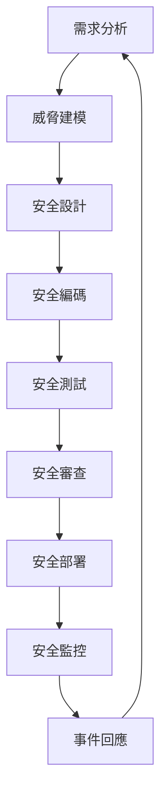

# 🔒 安全政策

## 🛡️ 安全概述

Auto Video 專案致力於維護最高標準的安全性。我們採用多層次安全架構，確保用戶數據和系統的安全性。

## 📋 支援版本

以下是目前接受安全更新的版本：

| 版本 | 支援狀態 |
| --- | --- |
| 1.0.x | ✅ 完全支援 |
| 0.9.x | ⚠️ 安全修復僅 |
| 0.8.x | ❌ 不再支援 |
| < 0.8 | ❌ 不再支援 |

## 🚨 回報安全漏洞

### 負責任的披露

我們非常重視系統安全。如果您發現安全漏洞，請遵循負責任的披露流程：

### 📧 聯絡方式

**🔴 請勿在公開 Issue 或論壇中討論安全漏洞！**

**主要聯絡:**
- **Email**: security@autovideo.com
- **PGP Key**: [下載公鑰](security/pgp-public-key.asc)
- **緊急聯絡**: +1-xxx-xxx-xxxx (24/7)

### 📝 漏洞報告格式

請在報告中包含以下資訊：

```
主旨: [SECURITY] 簡短漏洞描述

1. 漏洞類型: [如 SQL 注入、XSS、權限提升等]
2. 影響範圍: [如認證系統、資料庫、API 等]
3. 嚴重程度: [Critical/High/Medium/Low]
4. 受影響版本: [如 v1.0.0 - v1.2.3]
5. 重現步驟: [詳細的重現步驟]
6. 概念驗證: [PoC 代碼或截圖，如有]
7. 建議修復: [可能的修復建議]
8. 發現者資訊: [您的姓名/組織，用於致謝]
```

### ⏰ 回應時間表

| 階段 | 時間範圍 | 說明 |
|------|----------|------|
| 確認收到 | 24 小時 | 確認收到報告 |
| 初步評估 | 48 小時 | 評估漏洞嚴重性 |
| 詳細分析 | 7 天 | 完整技術分析 |
| 修復開發 | 14-30 天 | 根據嚴重性決定 |
| 安全更新發布 | 30 天內 | 發布修復版本 |
| 公開披露 | 90 天後 | 在修復後公開 |

## 🏆 安全獎勵計劃

我們設立安全獎勵計劃，感謝安全研究員的貢獻：

### 💰 獎勵等級

| 嚴重程度 | 獎勵金額 | 描述 |
|----------|----------|------|
| 🔴 Critical | $5,000 - $10,000 | 遠程代碼執行、完整系統接管 |
| 🟠 High | $1,000 - $5,000 | 權限提升、重要數據洩露 |
| 🟡 Medium | $500 - $1,000 | 認證繞過、中等影響漏洞 |
| 🟢 Low | $100 - $500 | 資訊洩露、低影響漏洞 |

### 🎯 獎勵範圍

**包含在內:**
- 主要應用程式和 API
- 認證和授權系統
- 資料庫安全
- 容器和基礎設施
- 第三方整合安全

**不包含在內:**
- 開發/測試環境
- 社交工程攻擊
- 物理攻擊
- DoS/DDoS 攻擊
- 已知問題的重複報告

## 🔐 安全架構

### 多層次防護

```
┌─────────────────────────────────────┐
│            用戶層                    │
├─────────────────────────────────────┤
│        應用層防護                    │
│  • WAF 防護                        │
│  • API 速率限制                     │
│  • 輸入驗證                        │
├─────────────────────────────────────┤
│        認證授權層                    │
│  • OAuth 2.0 / JWT                 │
│  • RBAC 權限控制                    │
│  • MFA 多因子認證                   │
├─────────────────────────────────────┤
│        網路安全層                    │
│  • TLS 1.3 加密                    │
│  • VPN 隧道                        │
│  • 防火牆規則                      │
├─────────────────────────────────────┤
│        資料保護層                    │
│  • 資料庫加密                      │
│  • 敏感資料遮罩                    │
│  • 備份加密                        │
├─────────────────────────────────────┤
│        基礎設施層                    │
│  • 容器安全                        │
│  • 主機加固                        │
│  • 網路隔離                        │
└─────────────────────────────────────┘
```

### 安全控制措施

#### 🔑 身份驗證與授權
- **JWT 令牌**: 使用 RS256 算法簽名
- **會話管理**: 安全的會話處理和失效機制
- **密碼安全**: bcrypt 哈希 + 鹽值
- **MFA 支援**: TOTP/SMS 雙因子認證
- **RBAC**: 基於角色的存取控制

#### 🛡️ 資料保護
- **加密儲存**: AES-256 加密敏感資料
- **傳輸加密**: TLS 1.3 端到端加密
- **金鑰管理**: HashiCorp Vault 金鑰管理
- **資料去識別**: 個人識別資訊去識別
- **備份安全**: 加密備份和安全恢復

#### 🌐 網路安全
- **HTTPS**: 強制使用 HTTPS
- **CORS**: 適當的跨域資源共享設定
- **CSP**: 內容安全政策防護
- **HSTS**: HTTP 嚴格傳輸安全
- **防火牆**: 應用層和網路層防火牆

#### 🔍 監控與審計
- **安全日誌**: 完整的安全事件日誌
- **異常檢測**: 行為異常自動檢測
- **入侵檢測**: IDS/IPS 系統
- **審計追蹤**: 完整的操作審計記錄
- **威脅情報**: 整合威脅情報來源

## 🔄 安全流程

### 安全開發生命週期 (SDLC)



### 🚨 事件回應計劃

#### 1. 檢測與分析
- **自動檢測**: 安全事件自動檢測
- **人工分析**: 安全團隊專業分析
- **嚴重性評估**: 事件嚴重性快速評估

#### 2. 圍堵與根除
- **隔離系統**: 受影響系統隔離
- **停止攻擊**: 阻止攻擊者進一步行動
- **根除威脅**: 完全清除惡意程式碼

#### 3. 恢復與跟進
- **系統恢復**: 安全恢復受影響系統
- **監控加強**: 加強監控防止復發
- **經驗學習**: 事後檢討和改進

## 📊 安全指標

### 關鍵安全指標 (KSI)

| 指標 | 目標值 | 監控頻率 |
|------|--------|----------|
| 漏洞修復時間 | < 30 天 | 每日 |
| 安全事件回應時間 | < 1 小時 | 即時 |
| 密碼強度合規率 | > 95% | 每週 |
| MFA 啟用率 | > 90% | 每月 |
| 安全掃描覆蓋率 | 100% | 每次部署 |

### 📈 安全儀表板

我們維護即時安全監控儀表板：
- **威脅檢測狀態**
- **漏洞管理進度**
- **合規性檢查結果**
- **安全培訓完成率**

## 🎓 安全培訓

### 開發人員安全培訓
- **OWASP Top 10** 威脅認知
- **安全編碼實踐** 培訓
- **威脅建模** 技能培養
- **事件回應** 程序訓練

### 定期安全演練
- **滲透測試**: 季度外部測試
- **紅藍軍演練**: 年度模擬攻擊
- **災難恢復演練**: 半年度演練
- **安全意識測試**: 月度釣魚測試

## 📋 合規性

### 遵循標準
- **ISO 27001**: 資訊安全管理系統
- **SOC 2 Type II**: 服務機構控制報告
- **GDPR**: 歐盟通用資料保護規範
- **CCPA**: 加州消費者隱私法案
- **OWASP**: 開放式網路應用安全計畫

### 定期審計
- **內部審計**: 季度安全審計
- **外部評估**: 年度第三方評估
- **滲透測試**: 半年度滲透測試
- **合規檢查**: 持續合規性監控

## 📞 聯絡資訊

### 安全團隊
- **安全長 (CISO)**: ciso@autovideo.com
- **安全工程師**: security-engineering@autovideo.com
- **事件回應小組**: incident-response@autovideo.com

### 緊急聯絡
- **24/7 安全熱線**: +1-xxx-xxx-xxxx
- **緊急簡訊**: security-alert@autovideo.com
- **Slack 頻道**: #security-incidents

---

## 📝 更新記錄

| 版本 | 日期 | 變更 |
|------|------|------|
| 2.0 | 2024-01-15 | 完整安全政策制定 |
| 1.1 | 2023-12-01 | 增加獎勵計劃 |
| 1.0 | 2023-10-01 | 初版發布 |

**最後更新**: 2024-01-15  
**下次審查**: 2024-07-15

---

*我們致力於維護最高標準的安全性。如果您有任何安全相關問題或建議，請隨時聯絡我們的安全團隊。*