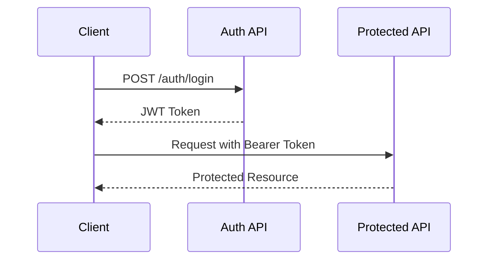

# 🔌 Auto Video API 完整參考文檔

## 📖 API 概覽

Auto Video API 是一個 RESTful API，採用統一的回應格式和認證機制。所有 API 都經過版本化管理，當前穩定版本為 `v1`。

### 基本資訊

- **Base URL**: `https://api.autovideo.com/api/v1`
- **協議**: HTTPS only
- **認證**: JWT Bearer Token
- **內容類型**: `application/json`
- **字符編碼**: UTF-8

### API 設計原則

- **RESTful**: 遵循 REST 架構原則
- **統一回應格式**: 所有 API 使用統一的回應結構
- **版本化**: 通過 URL 路徑進行版本控制
- **分頁**: 支援標準分頁機制
- **錯誤處理**: 詳細的錯誤碼和說明
- **速率限制**: 防止濫用的請求限制

## 🔐 認證系統

### JWT Token 機制

所有需要認證的 API 都使用 JWT Bearer Token：

```http
Authorization: Bearer <your-jwt-token>
```

### 認證流程



## 📊 標準回應格式

所有 API 回應都遵循以下統一格式：

```json
{
  "status": "success|error|warning|info",
  "message": "操作結果描述",
  "data": {
    // 實際資料內容
  },
  "errors": [
    {
      "code": "ERROR_CODE",
      "field": "field_name",
      "message": "詳細錯誤說明"
    }
  ],
  "pagination": {
    "page": 1,
    "size": 20,
    "total": 100,
    "pages": 5,
    "has_next": true,
    "has_prev": false
  },
  "metadata": {
    "timestamp": "2024-01-01T00:00:00Z",
    "request_id": "req-123",
    "version": "v1",
    "service": "api-gateway",
    "execution_time_ms": 150.5
  }
}
```

### 狀態碼說明

| HTTP 狀態碼 | 說明 | 使用場景 |
|-------------|------|----------|
| 200 | OK | 請求成功 |
| 201 | Created | 資源創建成功 |
| 204 | No Content | 刪除成功 |
| 400 | Bad Request | 請求參數錯誤 |
| 401 | Unauthorized | 未認證或認證過期 |
| 403 | Forbidden | 權限不足 |
| 404 | Not Found | 資源不存在 |
| 422 | Unprocessable Entity | 驗證失敗 |
| 429 | Too Many Requests | 請求過於頻繁 |
| 500 | Internal Server Error | 服務器內部錯誤 |
| 503 | Service Unavailable | 服務暫時不可用 |

## 👤 認證服務 API

### 用戶註冊

```http
POST /api/v1/auth/register
```

**請求體：**
```json
{
  "username": "john_doe",
  "email": "john@example.com",
  "password": "SecurePassword123!",
  "full_name": "John Doe",
  "accept_terms": true
}
```

**回應：**
```json
{
  "status": "success",
  "message": "用戶註冊成功",
  "data": {
    "user_id": "user_123456",
    "username": "john_doe",
    "email": "john@example.com",
    "full_name": "John Doe",
    "created_at": "2024-01-01T00:00:00Z",
    "email_verified": false
  }
}
```

**驗證規則：**
- `username`: 3-30 字符，只能包含字母、數字、下劃線
- `email`: 有效的電子郵件格式
- `password`: 至少 8 字符，包含大小寫字母、數字和特殊字符
- `full_name`: 1-100 字符
- `accept_terms`: 必須為 true

### 用戶登入

```http
POST /api/v1/auth/login
```

**請求體：**
```json
{
  "email": "john@example.com",
  "password": "SecurePassword123!"
}
```

**回應：**
```json
{
  "status": "success",
  "message": "登入成功",
  "data": {
    "access_token": "eyJ0eXAiOiJKV1QiLCJhbGciOiJIUzI1NiJ9...",
    "token_type": "bearer",
    "expires_in": 3600,
    "refresh_token": "eyJ0eXAiOiJKV1QiLCJhbGciOiJIUzI1NiJ9...",
    "user": {
      "user_id": "user_123456",
      "username": "john_doe",
      "email": "john@example.com",
      "full_name": "John Doe",
      "avatar_url": "https://example.com/avatar.jpg",
      "roles": ["user"],
      "email_verified": true
    }
  }
}
```

### 刷新令牌

```http
POST /api/v1/auth/refresh
```

**請求體：**
```json
{
  "refresh_token": "eyJ0eXAiOiJKV1QiLCJhbGciOiJIUzI1NiJ9..."
}
```

### 用戶登出

```http
POST /api/v1/auth/logout
Authorization: Bearer <access-token>
```

### 忘記密碼

```http
POST /api/v1/auth/forgot-password
```

**請求體：**
```json
{
  "email": "john@example.com"
}
```

### 重置密碼

```http
POST /api/v1/auth/reset-password
```

**請求體：**
```json
{
  "token": "reset_token_here",
  "new_password": "NewSecurePassword123!"
}
```

## 👥 用戶管理 API

### 獲取當前用戶資訊

```http
GET /api/v1/users/me
Authorization: Bearer <access-token>
```

**回應：**
```json
{
  "status": "success",
  "message": "獲取用戶資訊成功",
  "data": {
    "user_id": "user_123456",
    "username": "john_doe",
    "email": "john@example.com",
    "full_name": "John Doe",
    "bio": "我是一個內容創作者",
    "avatar_url": "https://example.com/avatar.jpg",
    "website": "https://johndoe.com",
    "location": "台北, 台灣",
    "created_at": "2024-01-01T00:00:00Z",
    "updated_at": "2024-01-15T12:30:00Z",
    "email_verified": true,
    "subscription": {
      "plan": "premium",
      "expires_at": "2024-12-31T23:59:59Z"
    },
    "statistics": {
      "videos_created": 42,
      "total_views": 15420,
      "followers": 128
    }
  }
}
```

### 更新用戶資訊

```http
PUT /api/v1/users/me
Authorization: Bearer <access-token>
```

**請求體：**
```json
{
  "full_name": "John Doe Updated",
  "bio": "更新後的個人簡介",
  "website": "https://newwebsite.com",
  "location": "新竹, 台灣"
}
```

### 更改密碼

```http
POST /api/v1/users/me/change-password
Authorization: Bearer <access-token>
```

**請求體：**
```json
{
  "current_password": "CurrentPassword123!",
  "new_password": "NewPassword123!"
}
```

### 上傳頭像

```http
POST /api/v1/users/me/avatar
Authorization: Bearer <access-token>
Content-Type: multipart/form-data
```

**請求體：**
```
avatar: [圖片文件]
```

**限制：**
- 文件大小：最大 5MB
- 支援格式：JPG, PNG, WebP
- 圖片尺寸：最小 100x100，最大 2000x2000

## 🎬 影片管理 API

### 獲取影片列表

```http
GET /api/v1/videos
Authorization: Bearer <access-token>
```

**查詢參數：**
| 參數 | 類型 | 必填 | 說明 | 範例 |
|------|------|------|------|------|
| page | integer | 否 | 頁碼，從 1 開始 | `page=1` |
| size | integer | 否 | 每頁大小，1-100 | `size=20` |
| search | string | 否 | 搜索關鍵字 | `search=教學影片` |
| status | string | 否 | 影片狀態篩選 | `status=completed` |
| platform | string | 否 | 平台篩選 | `platform=youtube` |
| sort | string | 否 | 排序字段 | `sort=created_at` |
| order | string | 否 | 排序方向 | `order=desc` |
| tags | string | 否 | 標籤篩選（逗號分隔） | `tags=AI,教育` |

**回應：**
```json
{
  "status": "success",
  "message": "獲取影片列表成功",
  "data": [
    {
      "video_id": "video_123456",
      "title": "我的第一個 AI 影片",
      "description": "使用 AI 技術創作的精彩內容",
      "thumbnail_url": "https://example.com/thumbnail.jpg",
      "video_url": "https://example.com/video.mp4",
      "duration": 180,
      "status": "completed",
      "platforms": ["youtube", "tiktok"],
      "tags": ["AI", "教育", "科技"],
      "statistics": {
        "views": 1524,
        "likes": 89,
        "shares": 12,
        "comments": 5
      },
      "created_at": "2024-01-01T00:00:00Z",
      "updated_at": "2024-01-01T00:30:00Z",
      "published_at": "2024-01-01T01:00:00Z"
    }
  ],
  "pagination": {
    "page": 1,
    "size": 20,
    "total": 42,
    "pages": 3,
    "has_next": true,
    "has_prev": false
  }
}
```

### 獲取單個影片詳情

```http
GET /api/v1/videos/{video_id}
Authorization: Bearer <access-token>
```

**回應：**
```json
{
  "status": "success",
  "message": "獲取影片詳情成功",
  "data": {
    "video_id": "video_123456",
    "title": "我的第一個 AI 影片",
    "description": "使用 AI 技術創作的精彩內容",
    "script": {
      "content": "歡迎來到我的頻道...",
      "word_count": 245,
      "estimated_duration": 180
    },
    "voice": {
      "provider": "elevenlabs",
      "voice_id": "voice_456",
      "voice_name": "專業男聲",
      "language": "zh-TW"
    },
    "visuals": [
      {
        "type": "image",
        "url": "https://example.com/scene1.jpg",
        "timestamp": 0,
        "duration": 5,
        "prompt": "美麗的風景畫面"
      },
      {
        "type": "text",
        "content": "歡迎來到我的頻道",
        "timestamp": 5,
        "duration": 3,
        "style": "title"
      }
    ],
    "thumbnail_url": "https://example.com/thumbnail.jpg",
    "video_url": "https://example.com/video.mp4",
    "duration": 180,
    "resolution": "1920x1080",
    "format": "mp4",
    "file_size": 52428800,
    "status": "completed",
    "processing_progress": 100,
    "platforms": ["youtube", "tiktok"],
    "tags": ["AI", "教育", "科技"],
    "statistics": {
      "views": 1524,
      "likes": 89,
      "shares": 12,
      "comments": 5,
      "engagement_rate": 6.8
    },
    "seo": {
      "title": "優化後的標題",
      "description": "SEO 優化描述",
      "keywords": ["AI", "影片製作", "自動化"]
    },
    "created_at": "2024-01-01T00:00:00Z",
    "updated_at": "2024-01-01T00:30:00Z",
    "published_at": "2024-01-01T01:00:00Z"
  }
}
```

### 創建新影片

```http
POST /api/v1/videos
Authorization: Bearer <access-token>
```

**請求體：**
```json
{
  "title": "我的新影片",
  "description": "這是一個使用 AI 創作的影片",
  "script_prompt": "創作一個關於人工智能未來發展的 3 分鐘教學影片",
  "voice_config": {
    "provider": "elevenlabs",
    "voice_id": "voice_456",
    "speed": 1.0,
    "stability": 0.8,
    "similarity": 0.8
  },
  "visual_config": {
    "style": "modern",
    "aspect_ratio": "16:9",
    "resolution": "1920x1080",
    "include_subtitles": true,
    "background_music": true
  },
  "platforms": ["youtube", "tiktok", "instagram"],
  "tags": ["AI", "教育", "未來"],
  "schedule": {
    "publish_immediately": false,
    "publish_at": "2024-01-02T10:00:00Z"
  },
  "seo_optimize": true
}
```

**回應：**
```json
{
  "status": "success",
  "message": "影片創建成功，正在處理中",
  "data": {
    "video_id": "video_789012",
    "title": "我的新影片",
    "status": "processing",
    "processing_progress": 0,
    "estimated_completion": "2024-01-01T00:15:00Z",
    "created_at": "2024-01-01T00:00:00Z"
  }
}
```

### 更新影片資訊

```http
PUT /api/v1/videos/{video_id}
Authorization: Bearer <access-token>
```

**請求體：**
```json
{
  "title": "更新後的標題",
  "description": "更新後的描述",
  "tags": ["更新", "標籤"],
  "platforms": ["youtube", "instagram"]
}
```

### 刪除影片

```http
DELETE /api/v1/videos/{video_id}
Authorization: Bearer <access-token>
```

### 獲取影片處理狀態

```http
GET /api/v1/videos/{video_id}/status
Authorization: Bearer <access-token>
```

**回應：**
```json
{
  "status": "success",
  "message": "獲取處理狀態成功",
  "data": {
    "video_id": "video_123456",
    "status": "processing",
    "progress": 65,
    "current_stage": "voice_synthesis",
    "stages": [
      {
        "name": "script_generation",
        "status": "completed",
        "progress": 100,
        "started_at": "2024-01-01T00:00:00Z",
        "completed_at": "2024-01-01T00:02:00Z"
      },
      {
        "name": "voice_synthesis",
        "status": "processing",
        "progress": 65,
        "started_at": "2024-01-01T00:02:00Z",
        "estimated_completion": "2024-01-01T00:08:00Z"
      },
      {
        "name": "visual_generation",
        "status": "pending",
        "progress": 0
      },
      {
        "name": "video_assembly",
        "status": "pending",
        "progress": 0
      }
    ],
    "estimated_completion": "2024-01-01T00:15:00Z",
    "error": null
  }
}
```

## 🤖 AI 服務 API

### 腳本生成

```http
POST /api/v1/ai/script/generate
Authorization: Bearer <access-token>
```

**請求體：**
```json
{
  "prompt": "創作一個關於區塊鏈技術的 5 分鐘教學影片",
  "target_platform": "youtube",
  "tone": "professional",
  "target_audience": "初學者",
  "language": "zh-TW",
  "include_hook": true,
  "include_cta": true,
  "keywords": ["區塊鏈", "加密貨幣", "去中心化"]
}
```

**回應：**
```json
{
  "status": "success",
  "message": "腳本生成成功",
  "data": {
    "script_id": "script_123456",
    "content": "大家好，歡迎來到今天的區塊鏈教學！\n\n在今天這個數位時代...",
    "word_count": 485,
    "estimated_duration": 300,
    "sections": [
      {
        "type": "hook",
        "content": "大家好，歡迎來到今天的區塊鏈教學！",
        "timestamp": 0,
        "duration": 10
      },
      {
        "type": "introduction",
        "content": "在今天這個數位時代，區塊鏈技術...",
        "timestamp": 10,
        "duration": 30
      }
    ],
    "seo_keywords": ["區塊鏈", "加密貨幣", "去中心化", "智能合約"],
    "generated_at": "2024-01-01T00:00:00Z"
  }
}
```

### 圖像生成

```http
POST /api/v1/ai/images/generate
Authorization: Bearer <access-token>
```

**請求體：**
```json
{
  "prompt": "一個現代化的辦公室，有很多電腦和科技設備",
  "style": "photorealistic",
  "aspect_ratio": "16:9",
  "resolution": "1920x1080",
  "provider": "stable-diffusion",
  "negative_prompt": "blurry, low quality, distorted",
  "steps": 30,
  "guidance_scale": 7.5,
  "seed": 12345
}
```

**回應：**
```json
{
  "status": "success",
  "message": "圖像生成成功",
  "data": {
    "image_id": "img_123456",
    "url": "https://example.com/generated/image.jpg",
    "thumbnail_url": "https://example.com/generated/thumb.jpg",
    "prompt": "一個現代化的辦公室，有很多電腦和科技設備",
    "resolution": "1920x1080",
    "format": "jpg",
    "file_size": 2048576,
    "metadata": {
      "provider": "stable-diffusion",
      "model": "sd-xl-1.0",
      "steps": 30,
      "guidance_scale": 7.5,
      "seed": 12345
    },
    "generated_at": "2024-01-01T00:00:00Z"
  }
}
```

### 語音合成

```http
POST /api/v1/ai/voice/synthesize
Authorization: Bearer <access-token>
```

**請求體：**
```json
{
  "text": "歡迎來到我的頻道，今天我們要談論人工智能的未來發展。",
  "voice_id": "voice_456",
  "provider": "elevenlabs",
  "language": "zh-TW",
  "speed": 1.0,
  "pitch": 0.0,
  "stability": 0.8,
  "similarity": 0.8,
  "style": 0.0,
  "use_speaker_boost": true
}
```

**回應：**
```json
{
  "status": "success",
  "message": "語音合成成功",
  "data": {
    "audio_id": "audio_123456",
    "url": "https://example.com/generated/audio.mp3",
    "duration": 12.5,
    "format": "mp3",
    "sample_rate": 44100,
    "file_size": 512000,
    "text": "歡迎來到我的頻道，今天我們要談論人工智能的未來發展。",
    "voice_config": {
      "voice_id": "voice_456",
      "voice_name": "專業男聲",
      "provider": "elevenlabs",
      "language": "zh-TW"
    },
    "generated_at": "2024-01-01T00:00:00Z"
  }
}
```

### 獲取可用語音列表

```http
GET /api/v1/ai/voice/voices
Authorization: Bearer <access-token>
```

**查詢參數：**
| 參數 | 類型 | 必填 | 說明 |
|------|------|------|------|
| provider | string | 否 | 語音提供商 |
| language | string | 否 | 語言代碼 |
| gender | string | 否 | 性別 (male/female) |

**回應：**
```json
{
  "status": "success",
  "message": "獲取語音列表成功",
  "data": [
    {
      "voice_id": "voice_456",
      "name": "專業男聲",
      "description": "適合教學和專業內容的男性聲音",
      "provider": "elevenlabs",
      "language": "zh-TW",
      "gender": "male",
      "age": "adult",
      "accent": "台灣口音",
      "sample_url": "https://example.com/voice_sample.mp3",
      "preview_text": "這是語音預覽文字",
      "is_premium": false
    }
  ]
}
```

## 📱 社群媒體整合 API

### 獲取連接的平台

```http
GET /api/v1/social/platforms
Authorization: Bearer <access-token>
```

**回應：**
```json
{
  "status": "success",
  "message": "獲取平台連接狀態成功",
  "data": [
    {
      "platform": "youtube",
      "connected": true,
      "account_info": {
        "channel_id": "UC123456789",
        "channel_name": "我的 YouTube 頻道",
        "subscriber_count": 1520,
        "total_views": 45632
      },
      "permissions": ["upload", "analytics", "comments"],
      "connected_at": "2024-01-01T00:00:00Z",
      "expires_at": "2024-12-31T23:59:59Z"
    },
    {
      "platform": "tiktok",
      "connected": false,
      "connect_url": "https://example.com/connect/tiktok"
    }
  ]
}
```

### 連接社群平台

```http
POST /api/v1/social/platforms/{platform}/connect
Authorization: Bearer <access-token>
```

**回應：**
```json
{
  "status": "success",
  "message": "請完成授權流程",
  "data": {
    "authorization_url": "https://oauth.platform.com/authorize?client_id=...",
    "state": "random_state_string",
    "expires_in": 600
  }
}
```

### 發布影片到平台

```http
POST /api/v1/social/publish
Authorization: Bearer <access-token>
```

**請求體：**
```json
{
  "video_id": "video_123456",
  "platforms": [
    {
      "name": "youtube",
      "config": {
        "title": "我的 YouTube 影片標題",
        "description": "影片描述內容...",
        "tags": ["教學", "AI", "科技"],
        "category": "Education",
        "privacy": "public",
        "thumbnail": "custom_thumbnail.jpg",
        "playlist_id": "PLxxxxxxxxxxxx"
      }
    },
    {
      "name": "tiktok",
      "config": {
        "caption": "有趣的 AI 教學影片 #AI #教學 #科技",
        "privacy": "public",
        "allow_comments": true,
        "allow_duet": true,
        "allow_stitch": true
      }
    }
  ],
  "schedule": {
    "publish_immediately": false,
    "publish_at": "2024-01-02T10:00:00Z"
  }
}
```

**回應：**
```json
{
  "status": "success",
  "message": "發布任務已排程",
  "data": {
    "publish_id": "pub_123456",
    "video_id": "video_123456",
    "platforms": [
      {
        "platform": "youtube",
        "status": "scheduled",
        "publish_at": "2024-01-02T10:00:00Z",
        "estimated_url": "https://youtube.com/watch?v=XXXXXXXXX"
      },
      {
        "platform": "tiktok",
        "status": "scheduled",
        "publish_at": "2024-01-02T10:00:00Z"
      }
    ],
    "scheduled_at": "2024-01-02T10:00:00Z"
  }
}
```

### 獲取發布狀態

```http
GET /api/v1/social/publish/{publish_id}
Authorization: Bearer <access-token>
```

**回應：**
```json
{
  "status": "success",
  "message": "獲取發布狀態成功",
  "data": {
    "publish_id": "pub_123456",
    "video_id": "video_123456",
    "overall_status": "completed",
    "platforms": [
      {
        "platform": "youtube",
        "status": "published",
        "published_at": "2024-01-02T10:00:15Z",
        "url": "https://youtube.com/watch?v=ABCDEFGHIJK",
        "video_id": "ABCDEFGHIJK",
        "statistics": {
          "views": 152,
          "likes": 12,
          "comments": 3
        }
      },
      {
        "platform": "tiktok",
        "status": "failed",
        "error": {
          "code": "UPLOAD_FAILED",
          "message": "影片格式不支援",
          "details": "TikTok 不支援此解析度"
        },
        "retry_available": true
      }
    ]
  }
}
```

## 📊 分析統計 API

### 獲取總體統計

```http
GET /api/v1/analytics/overview
Authorization: Bearer <access-token>
```

**查詢參數：**
| 參數 | 類型 | 必填 | 說明 |
|------|------|------|------|
| period | string | 否 | 時間週期 (7d, 30d, 90d, 1y) |
| start_date | string | 否 | 開始日期 (YYYY-MM-DD) |
| end_date | string | 否 | 結束日期 (YYYY-MM-DD) |

**回應：**
```json
{
  "status": "success",
  "message": "獲取統計數據成功",
  "data": {
    "period": "30d",
    "start_date": "2024-01-01",
    "end_date": "2024-01-31",
    "summary": {
      "total_videos": 15,
      "total_views": 25648,
      "total_likes": 1856,
      "total_shares": 234,
      "total_comments": 167,
      "engagement_rate": 8.5,
      "average_watch_time": 145.6,
      "subscriber_growth": 156
    },
    "platform_breakdown": [
      {
        "platform": "youtube",
        "videos": 8,
        "views": 18430,
        "likes": 1245,
        "shares": 156,
        "comments": 112
      },
      {
        "platform": "tiktok",
        "videos": 7,
        "views": 7218,
        "likes": 611,
        "shares": 78,
        "comments": 55
      }
    ],
    "trends": {
      "views_trend": 12.5,
      "engagement_trend": -2.3,
      "subscriber_trend": 18.7
    }
  }
}
```

### 獲取影片效能分析

```http
GET /api/v1/analytics/videos/{video_id}
Authorization: Bearer <access-token>
```

**回應：**
```json
{
  "status": "success",
  "message": "獲取影片分析成功",
  "data": {
    "video_id": "video_123456",
    "title": "我的 AI 教學影片",
    "published_at": "2024-01-01T10:00:00Z",
    "platforms": [
      {
        "platform": "youtube",
        "url": "https://youtube.com/watch?v=ABCDEFGHIJK",
        "statistics": {
          "views": 5248,
          "likes": 456,
          "dislikes": 12,
          "comments": 34,
          "shares": 67,
          "watch_time_minutes": 15680,
          "average_view_duration": 178,
          "click_through_rate": 5.2,
          "audience_retention": [
            {"timestamp": 0, "retention": 100},
            {"timestamp": 30, "retention": 85},
            {"timestamp": 60, "retention": 72},
            {"timestamp": 90, "retention": 58}
          ]
        },
        "demographics": {
          "age_groups": [
            {"range": "18-24", "percentage": 23.5},
            {"range": "25-34", "percentage": 45.2},
            {"range": "35-44", "percentage": 21.8},
            {"range": "45+", "percentage": 9.5}
          ],
          "gender": {
            "male": 62.3,
            "female": 37.7
          },
          "top_countries": [
            {"country": "TW", "percentage": 78.2},
            {"country": "HK", "percentage": 12.5},
            {"country": "SG", "percentage": 5.8}
          ]
        }
      }
    ],
    "performance_score": 85.2,
    "recommendations": [
      "影片開頭的觀眾留存率較低，建議優化前 30 秒的內容",
      "增加互動元素可提高參與度",
      "考慮在黃金時段發布以獲得更多曝光"
    ]
  }
}
```

### 獲取趨勢分析

```http
GET /api/v1/analytics/trends
Authorization: Bearer <access-token>
```

**查詢參數：**
| 參數 | 類型 | 必填 | 說明 |
|------|------|------|------|
| platform | string | 否 | 平台篩選 |
| category | string | 否 | 分類篩選 |
| region | string | 否 | 地區篩選 |

**回應：**
```json
{
  "status": "success",
  "message": "獲取趨勢分析成功",
  "data": {
    "trending_topics": [
      {
        "keyword": "人工智能",
        "trend_score": 95.8,
        "search_volume": 125000,
        "growth_rate": 23.5,
        "competition": "medium",
        "related_keywords": ["AI", "機器學習", "深度學習"]
      },
      {
        "keyword": "區塊鏈",
        "trend_score": 87.2,
        "search_volume": 89000,
        "growth_rate": 18.7,
        "competition": "high",
        "related_keywords": ["加密貨幣", "NFT", "去中心化"]
      }
    ],
    "viral_content": [
      {
        "platform": "tiktok",
        "content_type": "短教學",
        "engagement_rate": 12.5,
        "optimal_length": "30-60 seconds",
        "best_posting_time": "19:00-21:00"
      }
    ],
    "recommendations": [
      "人工智能相關內容目前熱度很高，建議多創作相關主題",
      "短形式教學內容在 TikTok 表現優異",
      "晚間 7-9 點是最佳發布時間"
    ]
  }
}
```

## 🔍 搜索與篩選 API

### 全域搜索

```http
GET /api/v1/search
Authorization: Bearer <access-token>
```

**查詢參數：**
| 參數 | 類型 | 必填 | 說明 |
|------|------|------|------|
| q | string | 是 | 搜索關鍵字 |
| type | string | 否 | 搜索類型 (videos, scripts, images, audio) |
| limit | integer | 否 | 結果數量限制 |

**回應：**
```json
{
  "status": "success",
  "message": "搜索完成",
  "data": {
    "query": "人工智能",
    "results": {
      "videos": [
        {
          "video_id": "video_123456",
          "title": "人工智能基礎教學",
          "description": "深入淺出講解人工智能...",
          "relevance_score": 0.95
        }
      ],
      "scripts": [
        {
          "script_id": "script_789012",
          "title": "AI 發展歷史腳本",
          "excerpt": "人工智能的發展可以追溯到...",
          "relevance_score": 0.88
        }
      ]
    },
    "total_results": 23,
    "search_time_ms": 45
  }
}
```

## ⚠️ 錯誤處理

### 標準錯誤碼

| 錯誤碼 | HTTP 狀態 | 說明 |
|--------|-----------|------|
| `ERR_1001` | 400 | 請求參數驗證失敗 |
| `ERR_1002` | 401 | 認證令牌無效或過期 |
| `ERR_1003` | 403 | 權限不足 |
| `ERR_1004` | 404 | 請求的資源不存在 |
| `ERR_1006` | 429 | 請求頻率超出限制 |
| `ERR_2001` | 404 | 用戶不存在 |
| `ERR_2002` | 409 | 用戶已存在 |
| `ERR_3001` | 500 | 影片處理失敗 |
| `ERR_4001` | 502 | AI 服務暫時不可用 |
| `ERR_4004` | 402 | API 配額不足 |
| `ERR_5001` | 502 | 社群平台 API 錯誤 |

### 錯誤回應範例

```json
{
  "status": "error",
  "message": "請求驗證失敗",
  "errors": [
    {
      "code": "ERR_1001",
      "field": "email",
      "message": "電子郵件格式不正確"
    },
    {
      "code": "ERR_1001",
      "field": "password",
      "message": "密碼長度至少需要 8 個字符"
    }
  ],
  "metadata": {
    "timestamp": "2024-01-01T00:00:00Z",
    "request_id": "req-123456",
    "version": "v1"
  }
}
```

## 🔄 速率限制

### 限制規則

| 端點類型 | 限制 | 時間窗口 |
|----------|------|----------|
| 認證相關 | 10 次 | 1 分鐘 |
| 影片創建 | 5 次 | 1 小時 |
| AI 生成 | 20 次 | 1 小時 |
| 一般查詢 | 1000 次 | 1 小時 |
| 檔案上傳 | 10 次 | 1 分鐘 |

### 限制標頭

回應中會包含以下速率限制標頭：

```http
X-RateLimit-Limit: 1000
X-RateLimit-Remaining: 999
X-RateLimit-Reset: 1640995200
X-RateLimit-Window: 3600
```

### 超出限制的回應

```json
{
  "status": "error",
  "message": "請求頻率超出限制",
  "errors": [
    {
      "code": "ERR_1006",
      "message": "您已達到每小時 1000 次請求的限制，請於 3542 秒後重試"
    }
  ],
  "metadata": {
    "retry_after": 3542,
    "limit_type": "hourly",
    "limit_value": 1000
  }
}
```

## 📚 SDK 與程式碼範例

### JavaScript/TypeScript SDK

```typescript
import { AutoVideoAPI } from '@autovideo/sdk';

const client = new AutoVideoAPI({
  baseURL: 'https://api.autovideo.com/api/v1',
  apiKey: 'your-api-key'
});

// 創建影片
const video = await client.videos.create({
  title: '我的新影片',
  script_prompt: '創作一個關於 AI 的教學影片',
  platforms: ['youtube', 'tiktok']
});

// 獲取處理狀態
const status = await client.videos.getStatus(video.video_id);

// 發布到社群平台
await client.social.publish({
  video_id: video.video_id,
  platforms: [{
    name: 'youtube',
    config: {
      title: '優化後的標題',
      description: '詳細描述...'
    }
  }]
});
```

### Python SDK

```python
from autovideo import AutoVideoClient

client = AutoVideoClient(
    base_url='https://api.autovideo.com/api/v1',
    api_key='your-api-key'
)

# 創建影片
video = client.videos.create(
    title='我的新影片',
    script_prompt='創作一個關於 AI 的教學影片',
    platforms=['youtube', 'tiktok']
)

# 等待處理完成
status = client.videos.wait_for_completion(video['video_id'])

# 獲取分析數據
analytics = client.analytics.get_video_stats(video['video_id'])
```

### cURL 範例

```bash
# 用戶登入
curl -X POST "https://api.autovideo.com/api/v1/auth/login" \
  -H "Content-Type: application/json" \
  -d '{
    "email": "user@example.com",
    "password": "password123"
  }'

# 創建影片
curl -X POST "https://api.autovideo.com/api/v1/videos" \
  -H "Authorization: Bearer your-jwt-token" \
  -H "Content-Type: application/json" \
  -d '{
    "title": "測試影片",
    "script_prompt": "創作一個簡短的介紹影片",
    "platforms": ["youtube"]
  }'

# 獲取影片列表
curl -X GET "https://api.autovideo.com/api/v1/videos?page=1&size=20" \
  -H "Authorization: Bearer your-jwt-token"
```

## 🔌 Webhook 事件

### 設定 Webhook

```http
POST /api/v1/webhooks
Authorization: Bearer <access-token>
```

**請求體：**
```json
{
  "url": "https://your-domain.com/webhook",
  "events": ["video.completed", "video.failed", "publish.completed"],
  "secret": "your-webhook-secret"
}
```

### 事件類型

| 事件 | 說明 | 載荷範例 |
|------|------|----------|
| `video.processing` | 影片開始處理 | 影片基本資訊 |
| `video.completed` | 影片處理完成 | 完整影片資訊 |
| `video.failed` | 影片處理失敗 | 錯誤詳情 |
| `publish.completed` | 發布完成 | 發布結果 |
| `publish.failed` | 發布失敗 | 錯誤詳情 |

### Webhook 載荷範例

```json
{
  "event": "video.completed",
  "timestamp": "2024-01-01T00:00:00Z",
  "data": {
    "video_id": "video_123456",
    "title": "我的影片",
    "status": "completed",
    "video_url": "https://example.com/video.mp4",
    "duration": 180
  },
  "webhook_id": "webhook_789012"
}
```

---

## 📞 支援與回饋

### 技術支援

- **文檔問題**: 請在 GitHub Issues 中回報
- **API 錯誤**: 請提供完整的錯誤回應和 request_id
- **功能建議**: 歡迎在 GitHub Discussions 中討論

### API 版本資訊

- **當前版本**: v1
- **支援期限**: 至少 2 年
- **升級通知**: 重大變更會提前 6 個月通知

### 更新日誌

請查看 [CHANGELOG.md](../CHANGELOG.md) 了解最新的 API 變更和新功能。

---

*本文檔持續更新中，如有任何問題或建議，歡迎透過 GitHub Issues 聯繫我們。*