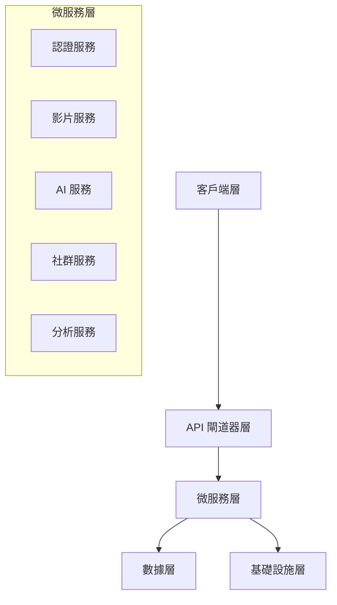

# 📖 Auto Video 開發者完整指南

## 🎯 指南概覽

本指南將引導您從零開始參與 Auto Video 專案開發，無論您是 Junior、Senior 還是 Professional 開發者，都能在這裡找到適合的起點。

## 📋 目錄

- [環境設置](#-環境設置)
- [專案架構理解](#-專案架構理解)
- [開發工作流程](#-開發工作流程)
- [編碼規範與最佳實踐](#-編碼規範與最佳實踐)
- [測試策略](#-測試策略)
- [調試技巧](#-調試技巧)
- [效能優化](#-效能優化)
- [安全考量](#-安全考量)

## 🛠️ 環境設置

### 系統要求

| 組件 | 最低版本 | 推薦版本 | 說明 |
|------|----------|----------|------|
| Python | 3.9+ | 3.11+ | 主要後端開發語言 |
| Node.js | 16+ | 18+ LTS | 前端開發環境 |
| Docker | 20.10+ | 24.0+ | 容器化部署 |
| Git | 2.20+ | 2.40+ | 版本控制 |
| RAM | 8GB | 16GB+ | 開發環境記憶體 |
| Storage | 50GB | 100GB+ | 專案和依賴存儲 |

### 詳細安裝步驟

#### 1. 系統準備（各平台）

<details>
<summary><strong>🍎 macOS</strong></summary>

```bash
# 安裝 Homebrew（如果未安裝）
/bin/bash -c "$(curl -fsSL https://raw.githubusercontent.com/Homebrew/install/HEAD/install.sh)"

# 安裝必要工具
brew install python@3.11 node@18 docker git
brew install --cask docker

# 安裝 Python 包管理工具
pip install --upgrade pip pipenv poetry

# 安裝 Node.js 包管理工具
npm install -g yarn pnpm
```

</details>

<details>
<summary><strong>🐧 Linux (Ubuntu/Debian)</strong></summary>

```bash
# 更新套件列表
sudo apt update && sudo apt upgrade -y

# 安裝 Python 和相關工具
sudo apt install -y python3.11 python3.11-venv python3-pip

# 安裝 Node.js 18.x
curl -fsSL https://deb.nodesource.com/setup_18.x | sudo -E bash -
sudo apt install -y nodejs

# 安裝 Docker
curl -fsSL https://get.docker.com -o get-docker.sh
sudo sh get-docker.sh
sudo usermod -aG docker $USER

# 安裝其他工具
sudo apt install -y git curl wget build-essential

# 重新登入以使 Docker 群組生效
newgrp docker
```

</details>

<details>
<summary><strong>🪟 Windows</strong></summary>

```powershell
# 使用 Chocolatey 安裝套件管理器
Set-ExecutionPolicy Bypass -Scope Process -Force
[System.Net.ServicePointManager]::SecurityProtocol = [System.Net.ServicePointManager]::SecurityProtocol -bor 3072
iex ((New-Object System.Net.WebClient).DownloadString('https://community.chocolatey.org/install.ps1'))

# 安裝開發工具
choco install python nodejs docker-desktop git -y

# 安裝 Windows Terminal 和 PowerShell Core
choco install microsoft-windows-terminal powershell-core -y

# 重啟電腦以完成 Docker Desktop 安裝
```

</details>

#### 2. 專案克隆與設置

```bash
# 1. 克隆專案
git clone https://github.com/your-org/auto-video.git
cd auto-video

# 2. 檢查環境
python --version    # 應該是 3.9+
node --version      # 應該是 16+
docker --version    # 應該是 20.10+

# 3. 執行自動化設置
chmod +x scripts/dev-setup.sh
./scripts/dev-setup.sh

# 4. 驗證安裝
./scripts/health-check.sh
```

#### 3. IDE 配置推薦

<details>
<summary><strong>🔷 Visual Studio Code</strong></summary>

**必裝擴展：**

```json
{
  "recommendations": [
    "ms-python.python",
    "ms-python.black-formatter",
    "ms-python.isort",
    "ms-python.flake8",
    "ms-python.mypy-type-checker",
    "svelte.svelte-vscode",
    "bradlc.vscode-tailwindcss",
    "ms-vscode.vscode-typescript-next",
    "esbenp.prettier-vscode",
    "ms-vscode.vscode-eslint",
    "ms-vscode-remote.remote-containers",
    "ms-azuretools.vscode-docker"
  ]
}
```

**設置檔案：**

```json
{
  "python.defaultInterpreterPath": "./venv/bin/python",
  "python.formatting.provider": "black",
  "python.linting.enabled": true,
  "python.linting.flake8Enabled": true,
  "python.linting.mypyEnabled": true,
  "editor.formatOnSave": true,
  "editor.codeActionsOnSave": {
    "source.organizeImports": true,
    "source.fixAll.eslint": true
  },
  "typescript.preferences.importModuleSpecifier": "relative",
  "svelte.enable-ts-plugin": true
}
```

</details>

<details>
<summary><strong>🔶 PyCharm Professional</strong></summary>

1. **專案結構設置**
   - 設置 `venv` 為專案解釋器
   - 標記 `tests` 為測試根目錄
   - 標記 `services` 為來源根目錄

2. **程式碼品質工具**
   - 啟用 Black 作為格式化工具
   - 配置 Flake8 作為檢查工具
   - 啟用 mypy 類型檢查

3. **Docker 整合**
   - 連接到 Docker 服務
   - 設置 Docker Compose 配置

</details>

## 🏗️ 專案架構理解

### 架構層級概覽



### 目錄結構詳解

```bash
auto-video/
├── 📁 services/                    # 🎯 核心微服務
│   ├── api-gateway/               # 🔐 API 閘道器 (Port: 8000)
│   │   ├── app/
│   │   │   ├── main.py           # 🚀 應用入口點
│   │   │   ├── middleware/       # 🛡️ 中間件（認證、CORS、限流）
│   │   │   ├── routers/          # 🔀 路由配置
│   │   │   └── dependencies/     # 💉 依賴注入
│   │   ├── tests/                # 🧪 服務測試
│   │   └── Dockerfile            # 🐳 容器化配置
│   │
│   ├── auth-service/             # 👤 認證服務 (Port: 8001)
│   │   ├── app/
│   │   │   ├── models/          # 📊 資料模型
│   │   │   ├── schemas/         # 📋 Pydantic 模式
│   │   │   ├── api/             # 🔌 API 端點
│   │   │   ├── core/            # ⚙️ 核心邏輯
│   │   │   └── db/              # 🗄️ 資料庫操作
│   │   └── migrations/          # 📈 資料庫遷移
│   │
│   └── [其他服務...]             # 類似結構
│
├── 🌐 frontend/                   # SvelteKit 前端
│   ├── src/
│   │   ├── lib/                  # 📚 共享程式庫
│   │   │   ├── components/      # 🧩 UI 組件
│   │   │   ├── stores/          # 🏪 狀態管理
│   │   │   ├── api/             # 🔗 API 客戶端
│   │   │   └── utils/           # 🛠️ 工具函數
│   │   ├── routes/              # 📄 頁面路由
│   │   └── app.html             # 🎨 應用模板
│   │
├── 🔧 shared/                     # 共享程式庫
│   ├── api/                      # 📡 API 標準格式
│   ├── auth/                     # 🔐 認證工具
│   ├── database/                 # 🗄️ 資料庫工具
│   ├── error_handling/           # ❌ 錯誤處理
│   └── utils/                    # 🛠️ 通用工具
│
├── 🗂️ config/                     # 配置文件
│   ├── base-config.json          # 📋 基礎配置
│   ├── auth-config.json          # 🔐 認證配置
│   ├── enterprise-config.json    # 🏢 企業配置
│   └── config_manager.py         # ⚙️ 配置管理器
│
├── 📊 monitoring/                 # 監控配置
│   ├── prometheus/               # 📈 指標收集
│   ├── grafana/                  # 📊 可視化儀表板
│   └── alertmanager/             # 🚨 告警管理
│
├── 🛠️ scripts/                    # 自動化腳本
│   ├── dev-setup.sh             # 🚀 開發環境設置
│   ├── test.sh                  # 🧪 測試執行
│   ├── quality-check.sh         # ✅ 代碼品質檢查
│   └── deploy.sh                # 🚀 部署腳本
│
└── 🧪 tests/                      # 測試文件
    ├── unit/                     # 🔬 單元測試
    ├── integration/              # 🔗 整合測試
    ├── e2e/                      # 🎭 端對端測試
    └── fixtures/                 # 📦 測試數據
```

### 服務間通信模式

#### 1. 同步通信（HTTP/REST）

```python
# 示例：認證服務調用用戶服務
import httpx
from shared.api.standard_responses import StandardResponse

async def get_user_profile(user_id: str, token: str) -> StandardResponse:
    async with httpx.AsyncClient() as client:
        response = await client.get(
            f"http://user-service:8002/api/v1/users/{user_id}",
            headers={"Authorization": f"Bearer {token}"}
        )
        return StandardResponse.parse_obj(response.json())
```

#### 2. 非同步通信（消息隊列）

```python
# 示例：影片處理完成事件
from celery import Celery
from shared.events import VideoProcessedEvent

celery_app = Celery('video-processor')

@celery_app.task
def process_video_completion(video_id: str, status: str):
    event = VideoProcessedEvent(
        video_id=video_id,
        status=status,
        timestamp=datetime.utcnow()
    )
    # 發布事件到消息隊列
    celery_app.send_task('notify.video_processed', args=[event.dict()])
```

## 🔄 開發工作流程

### Git 工作流程

我們採用 **Git Flow** 變體，針對微服務架構進行了優化：

```mermaid
gitgraph
    commit id: "Initial"
    branch develop
    checkout develop
    commit id: "Setup"
    
    branch feature/auth-oauth
    checkout feature/auth-oauth
    commit id: "Add OAuth"
    commit id: "Add tests"
    
    checkout develop
    merge feature/auth-oauth
    
    branch release/v1.2.0
    checkout release/v1.2.0
    commit id: "Version bump"
    commit id: "Bug fixes"
    
    checkout main
    merge release/v1.2.0
    tag: "v1.2.0"
    
    checkout develop
    merge release/v1.2.0
```

### 開發步驟詳解

#### 1. 功能開發流程

```bash
# 🔄 開始新功能開發
git checkout develop
git pull origin develop
git checkout -b feature/service-name/feature-description

# 📝 開發過程中
git add .
git commit -m "feat(service): add new feature implementation"

# 🧪 開發完成，執行完整測試
./scripts/test.sh
./scripts/quality-check.sh

# 📤 推送並創建 Pull Request
git push origin feature/service-name/feature-description
```

#### 2. 提交訊息規範

我們使用 **Conventional Commits** 標準：

```bash
<type>(<scope>): <description>

[optional body]

[optional footer(s)]
```

**類型定義：**

| 類型 | 說明 | 範例 |
|------|------|------|
| `feat` | 新功能 | `feat(auth): add OAuth 2.0 login` |
| `fix` | 錯誤修復 | `fix(video): resolve encoding timeout` |
| `docs` | 文檔更新 | `docs(api): update endpoint documentation` |
| `style` | 格式化變更 | `style(auth): fix indentation` |
| `refactor` | 重構 | `refactor(db): optimize query performance` |
| `test` | 測試相關 | `test(video): add unit tests for processor` |
| `chore` | 維護任務 | `chore(deps): update FastAPI to v0.104` |

#### 3. Pull Request 檢查清單

建立 PR 前請確認：

- [ ] **程式碼品質**
  - [ ] 通過所有 linting 檢查 (`./scripts/quality-check.sh`)
  - [ ] 遵循專案編碼規範
  - [ ] 沒有明顯的程式碼異味

- [ ] **測試覆蓋**
  - [ ] 新功能有對應的單元測試
  - [ ] 整合測試通過
  - [ ] 測試覆蓋率 ≥ 80%

- [ ] **文檔更新**
  - [ ] API 變更有對應的文檔更新
  - [ ] README 或相關指南已更新
  - [ ] 程式碼註釋完整且準確

- [ ] **安全檢查**  
  - [ ] 沒有硬編碼密鑰或敏感資訊
  - [ ] 通過安全掃描
  - [ ] 遵循最小權限原則

## 💻 編碼規範與最佳實踐

### Python 後端規範

#### 1. 程式碼結構

```python
#!/usr/bin/env python3
"""
模組描述
提供該模組的主要功能說明
"""

import os
import sys
from typing import Dict, List, Optional, Union
from datetime import datetime

from fastapi import FastAPI, HTTPException, Depends
from pydantic import BaseModel, Field

from shared.api.standard_responses import StandardResponse
from shared.auth.jwt_handler import verify_token

# 常數定義
DEFAULT_PAGE_SIZE = 20
MAX_PAGE_SIZE = 100

# 類型別名
UserId = str
VideoId = str

class VideoCreateRequest(BaseModel):
    """影片創建請求模型"""
    
    title: str = Field(..., min_length=1, max_length=200, description="影片標題")
    description: Optional[str] = Field(None, max_length=2000, description="影片描述")
    tags: List[str] = Field(default_factory=list, max_items=10, description="標籤列表")
    
    class Config:
        schema_extra = {
            "example": {
                "title": "我的第一個 AI 影片",
                "description": "使用 AI 生成的精彩內容",
                "tags": ["AI", "教育", "科技"]
            }
        }

class VideoService:
    """影片服務類"""
    
    def __init__(self, db_session: AsyncSession):
        self.db = db_session
    
    async def create_video(
        self, 
        request: VideoCreateRequest, 
        user_id: UserId
    ) -> StandardResponse:
        """
        創建新影片
        
        Args:
            request: 影片創建請求
            user_id: 用戶 ID
            
        Returns:
            StandardResponse: 標準 API 回應
            
        Raises:
            HTTPException: 當創建失敗時
        """
        try:
            # 業務邏輯實現
            video = await self._create_video_record(request, user_id)
            return StandardResponse(
                status="success",
                message="影片創建成功",
                data={"video_id": video.id}
            )
        except Exception as e:
            logger.error(f"影片創建失敗: {e}", extra={"user_id": user_id})
            raise HTTPException(status_code=500, detail="影片創建失敗")
    
    async def _create_video_record(
        self, 
        request: VideoCreateRequest, 
        user_id: UserId
    ) -> Video:
        """私有方法：創建影片記錄"""
        # 實現細節
        pass
```

#### 2. 錯誤處理最佳實踐

```python
from shared.error_handling.unified_errors import (
    ErrorHandler, 
    validation_error, 
    not_found_error
)

error_handler = ErrorHandler("video-service")

@app.exception_handler(ValueError)
async def value_error_handler(request: Request, exc: ValueError):
    error = error_handler.handle_error(
        exc,
        request_id=request.headers.get("X-Request-ID"),
        context={"path": request.url.path}
    )
    return JSONResponse(
        status_code=400,
        content=error.to_dict()
    )

# 業務邏輯中的錯誤處理
async def get_video(video_id: str) -> StandardResponse:
    try:
        video = await video_repository.get_by_id(video_id)
        if not video:
            return not_found_error("影片")
        
        return success_response("查詢成功", video.to_dict())
    
    except ValidationError as e:
        return validation_error("輸入參數錯誤", {"video_id": str(e)})
    
    except Exception as e:
        logger.exception("未預期的錯誤")
        return internal_error_response("系統暫時不可用")
```

### TypeScript 前端規範

#### 1. 組件結構

```typescript
<!-- VideoCard.svelte -->
<script lang="ts">
  import { createEventDispatcher, onMount } from 'svelte';
  import type { Video, VideoStatus } from '$lib/types/video';
  import { videoApi } from '$lib/api/video';
  import LoadingSpinner from '$lib/components/ui/LoadingSpinner.svelte';
  
  // Props
  export let video: Video;
  export let showActions: boolean = true;
  export let size: 'small' | 'medium' | 'large' = 'medium';
  
  // State
  let isLoading = false;
  let error: string | null = null;
  
  // Event dispatcher
  const dispatch = createEventDispatcher<{
    delete: { videoId: string };
    edit: { video: Video };
  }>();
  
  // Computed values
  $: statusColor = getStatusColor(video.status);
  $: formattedDuration = formatDuration(video.duration);
  
  // Functions
  function getStatusColor(status: VideoStatus): string {
    const colors = {
      processing: 'text-blue-600',
      completed: 'text-green-600',
      failed: 'text-red-600',
      pending: 'text-yellow-600'
    };
    return colors[status] || 'text-gray-600';
  }
  
  function formatDuration(seconds: number): string {
    const minutes = Math.floor(seconds / 60);
    const remainingSeconds = seconds % 60;
    return `${minutes}:${remainingSeconds.toString().padStart(2, '0')}`;
  }
  
  async function handleDelete(): Promise<void> {
    if (!confirm('確定要刪除這個影片嗎？')) return;
    
    isLoading = true;
    error = null;
    
    try {
      await videoApi.delete(video.id);
      dispatch('delete', { videoId: video.id });
    } catch (err) {
      error = err instanceof Error ? err.message : '刪除失敗';
    } finally {
      isLoading = false;
    }
  }
  
  onMount(() => {
    // 組件掛載邏輯
  });
</script>

<div class="video-card video-card--{size}" data-testid="video-card">
  <div class="video-card__thumbnail">
    
    <div class="video-card__duration">
      {formattedDuration}
    </div>
  </div>
  
  <div class="video-card__content">
    <h3 class="video-card__title">{video.title}</h3>
    <p class="video-card__description">{video.description}</p>
    
    <div class="video-card__meta">
      <span class="video-card__status {statusColor}">
        {video.status}
      </span>
      <time class="video-card__date">
        {new Date(video.createdAt).toLocaleDateString()}
      </time>
    </div>
    
    {#if showActions}
      <div class="video-card__actions">
        <button 
          type="button"
          on:click={() => dispatch('edit', { video })}
          disabled={isLoading}
        >
          編輯
        </button>
        
        <button 
          type="button"
          class="video-card__delete"
          on:click={handleDelete}
          disabled={isLoading}
        >
          {#if isLoading}
            <LoadingSpinner size="small" />
          {:else}
            刪除
          {/if}
        </button>
      </div>
    {/if}
    
    {#if error}
      <div class="video-card__error" role="alert">
        {error}
      </div>
    {/if}
  </div>
</div>

<style lang="postcss">
  .video-card {
    @apply bg-white rounded-lg shadow-md overflow-hidden transition-shadow hover:shadow-lg;
  }
  
  .video-card--small {
    @apply max-w-xs;
  }
  
  .video-card--medium {
    @apply max-w-md;
  }
  
  .video-card--large {
    @apply max-w-lg;
  }
  
  .video-card__thumbnail {
    @apply relative aspect-video;
  }
  
  .video-card__thumbnail img {
    @apply w-full h-full object-cover;
  }
  
  .video-card__duration {
    @apply absolute bottom-2 right-2 bg-black bg-opacity-75 text-white text-xs px-2 py-1 rounded;
  }
  
  .video-card__content {
    @apply p-4;
  }
  
  .video-card__title {
    @apply font-semibold text-lg mb-2 line-clamp-2;
  }
  
  .video-card__description {
    @apply text-gray-600 text-sm mb-3 line-clamp-3;
  }
  
  .video-card__meta {
    @apply flex justify-between items-center text-sm mb-3;
  }
  
  .video-card__status {
    @apply font-medium capitalize;
  }
  
  .video-card__date {
    @apply text-gray-500;
  }
  
  .video-card__actions {
    @apply flex gap-2;
  }
  
  .video-card__actions button {
    @apply px-3 py-1 rounded border transition-colors;
  }
  
  .video-card__actions button:not(.video-card__delete) {
    @apply border-blue-300 text-blue-600 hover:bg-blue-50;
  }
  
  .video-card__delete {
    @apply border-red-300 text-red-600 hover:bg-red-50;
  }
  
  .video-card__error {
    @apply mt-2 p-2 bg-red-100 border border-red-300 text-red-700 text-sm rounded;
  }
</style>
```

#### 2. API 客戶端實現

```typescript
// $lib/api/video.ts
import type { Video, VideoCreateRequest, VideoUpdateRequest } from '$lib/types/video';
import type { PaginatedResponse, StandardResponse } from '$lib/types/api';
import { apiClient } from './client';

class VideoApi {
  private readonly basePath = '/api/v1/videos';
  
  async list(params: {
    page?: number;
    size?: number;
    search?: string;
    status?: string;
  } = {}): Promise<PaginatedResponse<Video>> {
    const searchParams = new URLSearchParams();
    
    Object.entries(params).forEach(([key, value]) => {
      if (value !== undefined) {
        searchParams.append(key, String(value));
      }
    });
    
    const response = await apiClient.get(`${this.basePath}?${searchParams}`);
    
    if (!response.ok) {
      throw new Error(`Failed to fetch videos: ${response.statusText}`);
    }
    
    return response.json();
  }
  
  async get(id: string): Promise<StandardResponse<Video>> {
    const response = await apiClient.get(`${this.basePath}/${id}`);
    
    if (!response.ok) {
      if (response.status === 404) {
        throw new Error('影片不存在');
      }
      throw new Error(`Failed to fetch video: ${response.statusText}`);
    }
    
    return response.json();
  }
  
  async create(data: VideoCreateRequest): Promise<StandardResponse<Video>> {
    const response = await apiClient.post(this.basePath, {
      json: data
    });
    
    if (!response.ok) {
      const errorData = await response.json().catch(() => ({}));
      throw new Error(errorData.message || 'Failed to create video');
    }
    
    return response.json();
  }
  
  async update(id: string, data: VideoUpdateRequest): Promise<StandardResponse<Video>> {
    const response = await apiClient.put(`${this.basePath}/${id}`, {
      json: data
    });
    
    if (!response.ok) {
      const errorData = await response.json().catch(() => ({}));
      throw new Error(errorData.message || 'Failed to update video');
    }
    
    return response.json();
  }
  
  async delete(id: string): Promise<StandardResponse<null>> {
    const response = await apiClient.delete(`${this.basePath}/${id}`);
    
    if (!response.ok) {
      const errorData = await response.json().catch(() => ({}));
      throw new Error(errorData.message || 'Failed to delete video');
    }
    
    return response.json();
  }
}

export const videoApi = new VideoApi();
```

## 🧪 測試策略

### 測試金字塔

```
    /\
   /  \     E2E Tests (10%)
  /____\    - Playwright
 /      \   - 用戶流程測試
/________\  
          \  Integration Tests (30%)
           \ - API 整合測試
            \- 服務間通信測試
  __________\
            \ Unit Tests (60%)
             \- 函數邏輯測試
              \- 組件隔離測試
```

### Python 後端測試

#### 1. 單元測試示例

```python
# tests/unit/services/test_video_service.py
import pytest
from unittest.mock import AsyncMock, MagicMock
from fastapi import HTTPException

from services.video.app.core.video_service import VideoService
from services.video.app.schemas.video import VideoCreateRequest
from shared.api.standard_responses import StandardResponse

class TestVideoService:
    
    @pytest.fixture
    def mock_db_session(self):
        return AsyncMock()
    
    @pytest.fixture
    def video_service(self, mock_db_session):
        return VideoService(mock_db_session)
    
    @pytest.fixture
    def sample_video_request(self):
        return VideoCreateRequest(
            title="測試影片",
            description="這是一個測試影片",
            tags=["test", "demo"]
        )
    
    async def test_create_video_success(
        self, 
        video_service: VideoService, 
        sample_video_request: VideoCreateRequest
    ):
        """測試影片創建成功場景"""
        # Arrange
        user_id = "user-123"
        expected_video_id = "video-456"
        
        # Mock 資料庫操作
        mock_video = MagicMock()
        mock_video.id = expected_video_id
        video_service._create_video_record = AsyncMock(return_value=mock_video)
        
        # Act
        result = await video_service.create_video(sample_video_request, user_id)
        
        # Assert
        assert isinstance(result, StandardResponse)
        assert result.status == "success"
        assert result.message == "影片創建成功"
        assert result.data["video_id"] == expected_video_id
        video_service._create_video_record.assert_called_once_with(
            sample_video_request, user_id
        )
    
    async def test_create_video_validation_error(
        self, 
        video_service: VideoService
    ):
        """測試影片創建驗證錯誤"""
        # Arrange
        invalid_request = VideoCreateRequest(
            title="",  # 空標題應該失敗
            description="有效的描述"
        )
        
        # Act & Assert
        with pytest.raises(HTTPException) as exc_info:
            await video_service.create_video(invalid_request, "user-123")
        
        assert exc_info.value.status_code == 422
    
    async def test_create_video_database_error(
        self, 
        video_service: VideoService, 
        sample_video_request: VideoCreateRequest
    ):
        """測試資料庫錯誤處理"""
        # Arrange
        video_service._create_video_record = AsyncMock(
            side_effect=Exception("Database connection failed")
        )
        
        # Act & Assert
        with pytest.raises(HTTPException) as exc_info:
            await video_service.create_video(sample_video_request, "user-123")
        
        assert exc_info.value.status_code == 500
        assert "影片創建失敗" in str(exc_info.value.detail)
```

#### 2. 整合測試示例

```python
# tests/integration/test_video_api.py
import pytest
import httpx
from fastapi.testclient import TestClient

from services.video.app.main import app
from tests.fixtures.database import test_db_session
from tests.fixtures.auth import authenticated_user

@pytest.mark.asyncio
class TestVideoAPI:
    
    @pytest.fixture
    def client(self):
        return TestClient(app)
    
    async def test_create_video_flow(
        self, 
        client: TestClient, 
        test_db_session,
        authenticated_user
    ):
        """測試完整的影片創建流程"""
        # Arrange
        video_data = {
            "title": "整合測試影片",
            "description": "這是整合測試創建的影片",
            "tags": ["integration", "test"]
        }
        headers = {"Authorization": f"Bearer {authenticated_user.token}"}
        
        # Act - 創建影片
        response = client.post(
            "/api/v1/videos",
            json=video_data,
            headers=headers
        )
        
        # Assert - 檢查創建結果
        assert response.status_code == 201
        result = response.json()
        assert result["status"] == "success"
        assert "video_id" in result["data"]
        
        video_id = result["data"]["video_id"]
        
        # Act - 獲取創建的影片
        get_response = client.get(
            f"/api/v1/videos/{video_id}",
            headers=headers
        )
        
        # Assert - 檢查獲取結果
        assert get_response.status_code == 200
        video_data_response = get_response.json()
        assert video_data_response["data"]["title"] == video_data["title"]
        assert video_data_response["data"]["description"] == video_data["description"]
    
    async def test_video_list_pagination(
        self, 
        client: TestClient, 
        authenticated_user
    ):
        """測試影片列表分頁功能"""
        headers = {"Authorization": f"Bearer {authenticated_user.token}"}
        
        # 創建多個測試影片
        for i in range(25):
            client.post(
                "/api/v1/videos",
                json={
                    "title": f"測試影片 {i+1}",
                    "description": f"第 {i+1} 個測試影片"
                },
                headers=headers
            )
        
        # 測試第一頁
        response = client.get(
            "/api/v1/videos?page=1&size=10",
            headers=headers
        )
        
        assert response.status_code == 200
        result = response.json()
        assert len(result["data"]) == 10
        assert result["pagination"]["page"] == 1
        assert result["pagination"]["size"] == 10
        assert result["pagination"]["total"] >= 25
        assert result["pagination"]["has_next"] is True
        
        # 測試第二頁
        response = client.get(
            "/api/v1/videos?page=2&size=10",
            headers=headers
        )
        
        assert response.status_code == 200
        result = response.json()
        assert len(result["data"]) == 10
        assert result["pagination"]["page"] == 2
```

### 前端測試

#### 1. 組件單元測試

```typescript
// src/lib/components/VideoCard.test.ts
import { render, screen, fireEvent, waitFor } from '@testing-library/svelte';
import { vi } from 'vitest';
import VideoCard from './VideoCard.svelte';
import type { Video } from '$lib/types/video';

// Mock API
vi.mock('$lib/api/video', () => ({
  videoApi: {
    delete: vi.fn()
  }
}));

describe('VideoCard', () => {
  const sampleVideo: Video = {
    id: 'video-123',
    title: '測試影片',
    description: '這是一個測試影片',
    status: 'completed',
    duration: 120,
    thumbnailUrl: 'https://example.com/thumbnail.jpg',
    createdAt: '2024-01-01T00:00:00Z',
    updatedAt: '2024-01-01T00:00:00Z'
  };
  
  test('renders video information correctly', () => {
    render(VideoCard, { 
      props: { 
        video: sampleVideo 
      } 
    });
    
    expect(screen.getByText('測試影片')).toBeInTheDocument();
    expect(screen.getByText('這是一個測試影片')).toBeInTheDocument();
    expect(screen.getByText('2:00')).toBeInTheDocument(); // duration format
    expect(screen.getByText('completed')).toBeInTheDocument();
  });
  
  test('shows actions when showActions is true', () => {
    render(VideoCard, { 
      props: { 
        video: sampleVideo,
        showActions: true
      } 
    });
    
    expect(screen.getByText('編輯')).toBeInTheDocument();
    expect(screen.getByText('刪除')).toBeInTheDocument();
  });
  
  test('hides actions when showActions is false', () => {
    render(VideoCard, { 
      props: { 
        video: sampleVideo,
        showActions: false
      } 
    });
    
    expect(screen.queryByText('編輯')).not.toBeInTheDocument();
    expect(screen.queryByText('刪除')).not.toBeInTheDocument();
  });
  
  test('dispatches edit event when edit button is clicked', async () => {
    const { component } = render(VideoCard, { 
      props: { 
        video: sampleVideo,
        showActions: true
      } 
    });
    
    const editEventHandler = vi.fn();
    component.$on('edit', editEventHandler);
    
    const editButton = screen.getByText('編輯');
    await fireEvent.click(editButton);
    
    expect(editEventHandler).toHaveBeenCalledWith(
      expect.objectContaining({
        detail: { video: sampleVideo }
      })
    );
  });
  
  test('handles delete operation with confirmation', async () => {
    // Mock window.confirm
    vi.stubGlobal('confirm', vi.fn(() => true));
    
    const { videoApi } = await import('$lib/api/video');
    const mockDelete = vi.mocked(videoApi.delete);
    mockDelete.mockResolvedValue({
      status: 'success',
      message: '刪除成功',
      data: null,
      metadata: {
        timestamp: '2024-01-01T00:00:00Z'
      }
    });
    
    const { component } = render(VideoCard, { 
      props: { 
        video: sampleVideo,
        showActions: true
      } 
    });
    
    const deleteEventHandler = vi.fn();
    component.$on('delete', deleteEventHandler);
    
    const deleteButton = screen.getByText('刪除');
    await fireEvent.click(deleteButton);
    
    await waitFor(() => {
      expect(mockDelete).toHaveBeenCalledWith('video-123');
      expect(deleteEventHandler).toHaveBeenCalledWith(
        expect.objectContaining({
          detail: { videoId: 'video-123' }
        })
      );
    });
  });
  
  test('handles delete cancellation', async () => {
    // Mock window.confirm to return false
    vi.stubGlobal('confirm', vi.fn(() => false));
    
    const { videoApi } = await import('$lib/api/video');
    const mockDelete = vi.mocked(videoApi.delete);
    
    render(VideoCard, { 
      props: { 
        video: sampleVideo,
        showActions: true
      } 
    });
    
    const deleteButton = screen.getByText('刪除');
    await fireEvent.click(deleteButton);
    
    expect(mockDelete).not.toHaveBeenCalled();
  });
});
```

#### 2. 端對端測試

```typescript
// tests/e2e/video-management.spec.ts
import { test, expect } from '@playwright/test';

test.describe('影片管理', () => {
  test.beforeEach(async ({ page }) => {
    // 登入系統
    await page.goto('/login');
    await page.fill('[data-testid="email-input"]', 'test@example.com');
    await page.fill('[data-testid="password-input"]', 'password123');
    await page.click('[data-testid="login-button"]');
    
    // 等待跳轉到儀表板
    await expect(page).toHaveURL('/dashboard');
  });
  
  test('should create a new video', async ({ page }) => {
    // 導航到影片創建頁面
    await page.click('[data-testid="create-video-button"]');
    await expect(page).toHaveURL('/create');
    
    // 填寫影片資訊
    await page.fill('[data-testid="video-title"]', 'E2E 測試影片');
    await page.fill('[data-testid="video-description"]', '這是端對端測試創建的影片');
    
    // 選擇平台
    await page.check('[data-testid="platform-youtube"]');
    await page.check('[data-testid="platform-tiktok"]');
    
    // 生成腳本
    await page.click('[data-testid="generate-script-button"]');
    
    // 等待腳本生成完成
    await expect(page.locator('[data-testid="script-content"]')).toBeVisible();
    
    // 創建影片
    await page.click('[data-testid="create-video-submit"]');
    
    // 驗證創建成功
    await expect(page.locator('[data-testid="success-message"]')).toContainText('影片創建成功');
    
    // 驗證跳轉到影片列表
    await expect(page).toHaveURL('/videos');
    
    // 驗證新影片出現在列表中
    await expect(page.locator('[data-testid="video-card"]').first()).toContainText('E2E 測試影片');
  });
  
  test('should edit existing video', async ({ page }) => {
    // 創建測試影片（使用 API）
    const apiContext = await page.request.newContext();
    const response = await apiContext.post('/api/v1/videos', {
      headers: {
        'Authorization': `Bearer ${await getAuthToken(page)}`
      },
      data: {
        title: '待編輯的影片',
        description: '原始描述'
      }
    });
    
    const videoData = await response.json();
    const videoId = videoData.data.video_id;
    
    // 前往影片列表
    await page.goto('/videos');
    
    // 點擊編輯按鈕
    await page.click(`[data-testid="edit-video-${videoId}"]`);
    
    // 修改標題
    await page.fill('[data-testid="video-title"]', '已編輯的影片標題');
    await page.fill('[data-testid="video-description"]', '已更新的描述');
    
    // 保存變更
    await page.click('[data-testid="save-video-button"]');
    
    // 驗證更新成功
    await expect(page.locator('[data-testid="success-message"]')).toContainText('影片更新成功');
    
    // 驗證內容已更新
    await expect(page.locator(`[data-testid="video-card-${videoId}"]`)).toContainText('已編輯的影片標題');
  });
  
  test('should delete video with confirmation', async ({ page }) => {
    // 創建測試影片
    const apiContext = await page.request.newContext();
    const response = await apiContext.post('/api/v1/videos', {
      headers: {
        'Authorization': `Bearer ${await getAuthToken(page)}`
      },
      data: {
        title: '待刪除的影片',
        description: '將被刪除的測試影片'
      }
    });
    
    const videoData = await response.json();
    const videoId = videoData.data.video_id;
    
    // 前往影片列表
    await page.goto('/videos');
    
    // 點擊刪除按鈕
    await page.click(`[data-testid="delete-video-${videoId}"]`);
    
    // 處理確認對話框
    page.on('dialog', dialog => dialog.accept());
    
    // 驗證刪除成功
    await expect(page.locator('[data-testid="success-message"]')).toContainText('影片刪除成功');
    
    // 驗證影片不再出現在列表中
    await expect(page.locator(`[data-testid="video-card-${videoId}"]`)).not.toBeVisible();
  });
});

async function getAuthToken(page): Promise<string> {
  // 從本地存儲或其他方式獲取認證令牌
  return await page.evaluate(() => localStorage.getItem('auth_token'));
}
```

## 🔍 調試技巧

### 後端調試

#### 1. 日誌設置

```python
# 結構化日誌配置
import logging
import json
from datetime import datetime

class StructuredFormatter(logging.Formatter):
    def format(self, record):
        log_entry = {
            "timestamp": datetime.utcnow().isoformat(),
            "level": record.levelname,
            "service": "video-service",
            "message": record.getMessage(),
            "module": record.module,
            "function": record.funcName,
            "line": record.lineno
        }
        
        # 添加額外的上下文
        if hasattr(record, 'user_id'):
            log_entry["user_id"] = record.user_id
        
        if hasattr(record, 'request_id'):
            log_entry["request_id"] = record.request_id
        
        if record.exc_info:
            log_entry["exception"] = self.formatException(record.exc_info)
        
        return json.dumps(log_entry, ensure_ascii=False)

# 設置日誌
logging.basicConfig(
    level=logging.INFO,
    format='%(message)s',
    handlers=[
        logging.StreamHandler(),
        logging.FileHandler('logs/app.log')
    ]
)

logger = logging.getLogger(__name__)
logger.addHandler(logging.StreamHandler())
logger.handlers[0].setFormatter(StructuredFormatter())
```

#### 2. 效能分析工具

```python
import functools
import time
from typing import Callable, Any

def performance_monitor(func: Callable) -> Callable:
    """效能監控裝飾器"""
    
    @functools.wraps(func)
    async def async_wrapper(*args, **kwargs) -> Any:
        start_time = time.time()
        
        try:
            result = await func(*args, **kwargs)
            execution_time = time.time() - start_time
            
            logger.info(
                f"Function {func.__name__} executed successfully",
                extra={
                    "function": func.__name__,
                    "execution_time": execution_time,
                    "args_count": len(args),
                    "kwargs_count": len(kwargs)
                }
            )
            
            return result
            
        except Exception as e:
            execution_time = time.time() - start_time
            logger.error(
                f"Function {func.__name__} failed",
                extra={
                    "function": func.__name__,
                    "execution_time": execution_time,
                    "error": str(e)
                }
            )
            raise
    
    @functools.wraps(func)
    def sync_wrapper(*args, **kwargs) -> Any:
        start_time = time.time()
        
        try:
            result = func(*args, **kwargs)
            execution_time = time.time() - start_time
            
            logger.info(
                f"Function {func.__name__} executed successfully",
                extra={
                    "function": func.__name__,
                    "execution_time": execution_time
                }
            )
            
            return result
            
        except Exception as e:
            execution_time = time.time() - start_time
            logger.error(
                f"Function {func.__name__} failed",
                extra={
                    "function": func.__name__,
                    "execution_time": execution_time,
                    "error": str(e)
                }
            )
            raise
    
    return async_wrapper if asyncio.iscoroutinefunction(func) else sync_wrapper

# 使用示例
@performance_monitor
async def process_video(video_id: str) -> Video:
    # 影片處理邏輯
    pass
```

### 前端調試

#### 1. 開發工具設置

```typescript
// src/lib/utils/debug.ts
export const DEBUG = import.meta.env.DEV;

export function debugLog(message: string, data?: any): void {
  if (!DEBUG) return;
  
  const timestamp = new Date().toISOString();
  const logData = {
    timestamp,
    message,
    ...(data && { data })
  };
  
  console.group(`🐛 [${timestamp}] ${message}`);
  if (data) {
    console.table(data);
  }
  console.trace();
  console.groupEnd();
}

export function measurePerformance<T>(
  name: string, 
  fn: () => T | Promise<T>
): T | Promise<T> {
  if (!DEBUG) return fn();
  
  const start = performance.now();
  const result = fn();
  
  if (result instanceof Promise) {
    return result.finally(() => {
      const end = performance.now();
      console.log(`⏱️ ${name}: ${(end - start).toFixed(2)}ms`);
    });
  } else {
    const end = performance.now();
    console.log(`⏱️ ${name}: ${(end - start).toFixed(2)}ms`);
    return result;
  }
}

// Svelte store 調試
import { writable } from 'svelte/store';

export function debugStore<T>(name: string, initialValue: T) {
  const store = writable(initialValue);
  
  if (DEBUG) {
    store.subscribe(value => {
      console.log(`🏪 Store [${name}]:`, value);
    });
  }
  
  return store;
}
```

#### 2. API 調試中間件

```typescript
// src/lib/api/debug.ts
import type { RequestOptions, Response } from './types';

export async function debugMiddleware(
  url: string,
  options: RequestOptions,
  next: (url: string, options: RequestOptions) => Promise<Response>
): Promise<Response> {
  const requestId = crypto.randomUUID();
  const startTime = performance.now();
  
  console.group(`🌐 API Request [${requestId}]`);
  console.log('URL:', url);
  console.log('Method:', options.method || 'GET');
  console.log('Headers:', options.headers);
  console.log('Body:', options.body);
  
  try {
    const response = await next(url, options);
    const endTime = performance.now();
    
    console.log(`✅ Response (${(endTime - startTime).toFixed(2)}ms)`);
    console.log('Status:', response.status);
    console.log('Headers:', Object.fromEntries(response.headers.entries()));
    
    // 克隆回應以便調試檢查
    const clonedResponse = response.clone();
    clonedResponse.json().then(data => {
      console.log('Data:', data);
    }).catch(() => {
      console.log('Response is not JSON');
    });
    
    console.groupEnd();
    return response;
    
  } catch (error) {
    const endTime = performance.now();
    
    console.log(`❌ Error (${(endTime - startTime).toFixed(2)}ms)`);
    console.error('Error:', error);
    console.groupEnd();
    
    throw error;
  }
}
```

## 🚀 效能優化

### 後端效能優化

#### 1. 資料庫查詢優化

```python
# 避免 N+1 查詢問題
from sqlalchemy.orm import selectinload, joinedload

# 錯誤的做法（N+1 問題）
async def get_videos_with_tags_bad(db: AsyncSession) -> List[Video]:
    videos = await db.execute(select(Video))
    for video in videos.scalars():
        # 每個影片都會觸發一次資料庫查詢
        tags = await db.execute(
            select(Tag).where(Tag.video_id == video.id)
        )
        video.tags = tags.scalars().all()
    return videos.scalars().all()

# 正確的做法（使用 eager loading）
async def get_videos_with_tags_good(db: AsyncSession) -> List[Video]:
    result = await db.execute(
        select(Video).options(selectinload(Video.tags))
    )
    return result.scalars().all()

# 複雜查詢的優化
async def get_user_videos_with_stats(
    db: AsyncSession, 
    user_id: str,
    limit: int = 20
) -> List[VideoWithStats]:
    # 使用 CTE 和窗口函數進行複雜統計
    video_stats_cte = (
        select(
            Video.id,
            Video.title,
            Video.created_at,
            func.count(VideoView.id).label('view_count'),
            func.avg(VideoRating.rating).label('avg_rating'),
            func.row_number().over(
                order_by=Video.created_at.desc()
            ).label('row_num')
        )
        .outerjoin(VideoView)
        .outerjoin(VideoRating)
        .where(Video.user_id == user_id)
        .group_by(Video.id)
        .alias('video_stats')
    )
    
    result = await db.execute(
        select(video_stats_cte)
        .where(video_stats_cte.c.row_num <= limit)
    )
    
    return result.all()
```

#### 2. 快取策略

```python
import redis
import json
from typing import Optional, Any
from functools import wraps

redis_client = redis.Redis(
    host='redis', 
    port=6379, 
    decode_responses=True
)

def cache_result(expiration: int = 300):
    """結果快取裝飾器"""
    def decorator(func):
        @wraps(func)
        async def wrapper(*args, **kwargs):
            # 生成快取鍵
            cache_key = f"{func.__module__}.{func.__name__}:{hash(str(args) + str(kwargs))}"
            
            # 嘗試從快取獲取
            cached_result = redis_client.get(cache_key)
            if cached_result:
                return json.loads(cached_result)
            
            # 執行原函數
            result = await func(*args, **kwargs)
            
            # 儲存到快取
            redis_client.setex(
                cache_key, 
                expiration, 
                json.dumps(result, default=str)
            )
            
            return result
        return wrapper
    return decorator

# 多層快取策略
class CacheManager:
    def __init__(self):
        self.memory_cache = {}  # 本地記憶體快取
        self.redis_client = redis_client
    
    async def get(self, key: str) -> Optional[Any]:
        # L1: 記憶體快取
        if key in self.memory_cache:
            return self.memory_cache[key]
        
        # L2: Redis 快取
        redis_value = self.redis_client.get(key)
        if redis_value:
            value = json.loads(redis_value)
            # 回填到記憶體快取
            self.memory_cache[key] = value
            return value
        
        return None
    
    async def set(self, key: str, value: Any, ttl: int = 300):
        # 同時設置兩層快取
        self.memory_cache[key] = value
        self.redis_client.setex(key, ttl, json.dumps(value, default=str))
    
    def invalidate(self, pattern: str):
        # 清除快取
        keys = self.redis_client.keys(pattern)
        if keys:
            self.redis_client.delete(*keys)
        
        # 清除記憶體快取中的相關項目
        memory_keys = [k for k in self.memory_cache.keys() if pattern in k]
        for key in memory_keys:
            del self.memory_cache[key]

cache_manager = CacheManager()

# 使用示例
@cache_result(expiration=600)
async def get_trending_videos() -> List[Video]:
    # 昂貴的計算或查詢
    pass
```

### 前端效能優化

#### 1. 組件懶載入

```typescript
// src/lib/components/LazyComponent.svelte
<script lang="ts">
  import { onMount } from 'svelte';
  
  export let component: Promise<any>;
  export let fallback: any = null;
  export let error: any = null;
  
  let loadedComponent: any = null;
  let loading = true;
  let hasError = false;
  let errorMessage = '';
  
  onMount(async () => {
    try {
      const module = await component;
      loadedComponent = module.default || module;
      loading = false;
    } catch (err) {
      hasError = true;
      errorMessage = err instanceof Error ? err.message : 'Failed to load component';
      loading = false;
    }
  });
</script>

{#if loading}
  {#if fallback}
    <svelte:component this={fallback} />
  {:else}
    <div class="loading-placeholder">載入中...</div>
  {/if}
{:else if hasError}
  {#if error}
    <svelte:component this={error} message={errorMessage} />
  {:else}
    <div class="error-placeholder">載入失敗: {errorMessage}</div>
  {/if}
{:else}
  <svelte:component this={loadedComponent} {...$$props} />
{/if}

<style>
  .loading-placeholder, .error-placeholder {
    padding: 1rem;
    text-align: center;
    color: #666;
  }
  
  .error-placeholder {
    color: #dc2626;
    background-color: #fef2f2;
    border: 1px solid #fecaca;
    border-radius: 0.375rem;
  }
</style>
```

#### 2. 虛擬列表實現

```typescript
// src/lib/components/VirtualList.svelte
<script lang="ts">
  import { onMount, createEventDispatcher } from 'svelte';
  
  export let items: any[] = [];
  export let itemHeight: number = 50;
  export let containerHeight: number = 400;
  export let overscan: number = 5;
  
  const dispatch = createEventDispatcher();
  
  let container: HTMLDivElement;
  let scrollTop = 0;
  
  $: visibleStart = Math.max(0, Math.floor(scrollTop / itemHeight) - overscan);
  $: visibleEnd = Math.min(
    items.length,
    Math.ceil((scrollTop + containerHeight) / itemHeight) + overscan
  );
  $: visibleItems = items.slice(visibleStart, visibleEnd);
  $: totalHeight = items.length * itemHeight;
  $: offsetY = visibleStart * itemHeight;
  
  function handleScroll(event: Event) {
    const target = event.target as HTMLDivElement;
    scrollTop = target.scrollTop;
    
    dispatch('scroll', {
      scrollTop,
      visibleStart,
      visibleEnd
    });
  }
  
  onMount(() => {
    return () => {
      // 清理邏輯
    };
  });
</script>

<div 
  bind:this={container}
  class="virtual-list-container"
  style="height: {containerHeight}px;"
  on:scroll={handleScroll}
>
  <div 
    class="virtual-list-spacer"
    style="height: {totalHeight}px;"
  >
    <div 
      class="virtual-list-items"
      style="transform: translateY({offsetY}px);"
    >
      {#each visibleItems as item, index}
        <div 
          class="virtual-list-item"
          style="height: {itemHeight}px;"
          data-index={visibleStart + index}
        >
          <slot {item} index={visibleStart + index} />
        </div>
      {/each}
    </div>
  </div>
</div>

<style>
  .virtual-list-container {
    overflow-y: auto;
    position: relative;
  }
  
  .virtual-list-spacer {
    position: relative;
  }
  
  .virtual-list-items {
    position: absolute;
    top: 0;
    left: 0;
    right: 0;
  }
  
  .virtual-list-item {
    display: flex;
    align-items: center;
  }
</style>
```

## 🔒 安全考量

### 認證與授權

```python
# JWT 令牌管理
from datetime import datetime, timedelta
from typing import Optional
import jwt
from passlib.context import CryptContext

pwd_context = CryptContext(schemes=["bcrypt"], deprecated="auto")

class SecurityManager:
    def __init__(self, secret_key: str, algorithm: str = "HS256"):
        self.secret_key = secret_key
        self.algorithm = algorithm
    
    def create_access_token(
        self, 
        data: dict, 
        expires_delta: Optional[timedelta] = None
    ) -> str:
        to_encode = data.copy()
        
        if expires_delta:
            expire = datetime.utcnow() + expires_delta
        else:
            expire = datetime.utcnow() + timedelta(minutes=15)
        
        to_encode.update({"exp": expire})
        encoded_jwt = jwt.encode(to_encode, self.secret_key, algorithm=self.algorithm)
        return encoded_jwt
    
    def verify_token(self, token: str) -> Optional[dict]:
        try:
            payload = jwt.decode(token, self.secret_key, algorithms=[self.algorithm])
            return payload
        except jwt.ExpiredSignatureError:
            return None
        except jwt.JWTError:
            return None
    
    def hash_password(self, password: str) -> str:
        return pwd_context.hash(password)
    
    def verify_password(self, plain_password: str, hashed_password: str) -> bool:
        return pwd_context.verify(plain_password, hashed_password)

# RBAC 權限控制
from enum import Enum
from typing import List, Set

class Permission(Enum):
    VIDEO_CREATE = "video:create"
    VIDEO_READ = "video:read"
    VIDEO_UPDATE = "video:update"
    VIDEO_DELETE = "video:delete"
    ADMIN_ACCESS = "admin:access"

class Role(Enum):
    USER = "user"
    CREATOR = "creator"
    ADMIN = "admin"

ROLE_PERMISSIONS = {
    Role.USER: {
        Permission.VIDEO_READ,
    },
    Role.CREATOR: {
        Permission.VIDEO_CREATE,
        Permission.VIDEO_READ,
        Permission.VIDEO_UPDATE,
        Permission.VIDEO_DELETE,
    },
    Role.ADMIN: {
        Permission.VIDEO_CREATE,
        Permission.VIDEO_READ,
        Permission.VIDEO_UPDATE,
        Permission.VIDEO_DELETE,
        Permission.ADMIN_ACCESS,
    }
}

def has_permission(user_roles: List[Role], required_permission: Permission) -> bool:
    user_permissions = set()
    for role in user_roles:
        user_permissions.update(ROLE_PERMISSIONS.get(role, set()))
    
    return required_permission in user_permissions

# 權限檢查裝飾器
def require_permission(permission: Permission):
    def decorator(func):
        @wraps(func)
        async def wrapper(*args, **kwargs):
            # 從請求中獲取用戶角色
            current_user = get_current_user()  # 實現獲取當前用戶的邏輯
            
            if not has_permission(current_user.roles, permission):
                raise HTTPException(
                    status_code=403,
                    detail="權限不足"
                )
            
            return await func(*args, **kwargs)
        return wrapper
    return decorator
```

### 輸入驗證與清理

```python
from pydantic import BaseModel, validator, Field
import re
from typing import Optional, List
import bleach

class VideoCreateRequest(BaseModel):
    title: str = Field(..., min_length=1, max_length=200)
    description: Optional[str] = Field(None, max_length=2000)
    tags: List[str] = Field(default_factory=list, max_items=10)
    
    @validator('title')
    def validate_title(cls, v):
        # 清理 HTML 標籤
        cleaned = bleach.clean(v, tags=[], strip=True)
        
        # 檢查空白字符
        if not cleaned.strip():
            raise ValueError('標題不能為空或只包含空白字符')
        
        # 檢查惡意內容
        if '<script' in v.lower() or 'javascript:' in v.lower():
            raise ValueError('標題包含不允許的內容')
        
        return cleaned
    
    @validator('description')
    def validate_description(cls, v):
        if v is None:
            return v
        
        # 允許基本的 HTML 標籤
        allowed_tags = ['p', 'br', 'strong', 'em', 'u']
        cleaned = bleach.clean(v, tags=allowed_tags, strip=True)
        
        return cleaned
    
    @validator('tags')
    def validate_tags(cls, v):
        cleaned_tags = []
        tag_pattern = re.compile(r'^[a-zA-Z0-9\u4e00-\u9fff\s_-]+$')
        
        for tag in v:
            # 清理標籤
            cleaned_tag = bleach.clean(tag, tags=[], strip=True).strip()
            
            # 驗證標籤格式
            if not tag_pattern.match(cleaned_tag):
                raise ValueError(f'標籤 "{tag}" 包含不允許的字符')
            
            # 限制標籤長度
            if len(cleaned_tag) > 20:
                raise ValueError(f'標籤 "{tag}" 超過最大長度限制')
            
            cleaned_tags.append(cleaned_tag)
        
        return cleaned_tags
```

---

這份開發者指南涵蓋了從環境設置到高級優化的完整開發流程。無論您是什麼水平的開發者，都能找到適合的起點和深入的技術細節。建議按照指南循序漸進地學習和實踐，並結合實際專案需求進行調整。